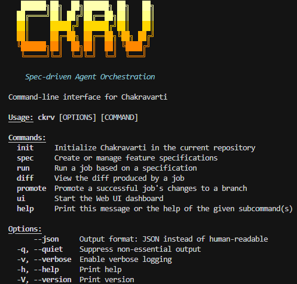

<h1 align="center">Chakravarti CLI</h1>

<p align="center">
  <strong>Spec-driven Agent Orchestration Engine</strong><br>
  <em>Code like an Architect, not a Typist.</em>
</p>

<p align="center">
  <a href="https://www.rust-lang.org/"></a>
  <a href="LICENSE"></a>
  <a href="https://deepwiki.com/FnSK4R17s/chakravarti-cli"></a>
</p>

---

Chakravarti (`ckrv`) is an autonomous coding engine that turns high-level specifications into shipping code. It orchestrates AI agents to plan, implement, and verify features in parallel, using isolated Git worktrees and Docker sandboxes to ensure safety and code integrity.

## Philosophy

Most AI coding tools are "autocomplete on steroids" or "single-file refactors." Chakravarti is an **Orchestrator**.

1.  **Design First**: You define the *What* and *Why* in a Specification (`spec.yaml`).
2.  **AI Planning**: The system analyzes your codebase and breaks the spec into actionable, dependency-aware batches.
3.  **Parallel Execution**: Agents execute tasks in parallel using isolated **Git Worktrees**. No working directory pollution.
4.  **Auto-Integration**: Completed code is automatically committed, merged, and propagated to dependent tasks.
5.  **Verification**: Every step runs in a Docker sandbox to ensure tests pass before merging.

## Quick Start

```bash
ckrv --help
```

<p align="center">
  
</p>

### 1. Initialize
Set up Chakravarti in your repository. This creates the `.specs` and `.chakravarti` directories.
```bash
ckrv init
```

### 2. Define a Spec
Describe your feature in natural language. The AI will generate a structured specification.
```bash
# Create a new branch and spec for your feature
git checkout -b feature/dark-mode
ckrv spec new "Implement dark mode with system preference detection and a toggle switch"
```

### 3. Generate Tasks
Ask the AI to analyze the codebase and generate a detailed implementation plan (`tasks.yaml`).
```bash
ckrv spec tasks
```
Review the generated `tasks.yaml` and `plan.yaml` in `.specs/feature/dark-mode/` to ensure the architecture is sound.

### 4. Orchestrate Execution
Run the full job. Chakravarti will:
- Plan execution batches.
- Spawn parallel agents in Docker containers.
- Execute tasks in git worktrees.
- Commit and merge successful changes.
```bash
ckrv run
```

### 5. Review and Promote
Inspect the changes, verify code quality, and create a Pull Request.

```bash
# View changes between your branch and main
ckrv diff

# Run tests, linting, and type checks
ckrv verify

# Fix any issues with AI assistance
ckrv fix --check

# Create a Pull Request
ckrv promote --push --open
```

## Primary Commands

| Command | Description |
|---------|-------------|
| `ckrv init` | Initialize Chakravarti in the current repository. |
| `ckrv spec new` | Create a new specification from a description. |
| `ckrv spec tasks` | Generate implementation tasks from a specification. |
| `ckrv run` | Execute the orchestration engine (Plan → Execute → Merge). |
| `ckrv diff` | View changes between current branch and main. |
| `ckrv verify` | Run tests, linting, and type checking. |
| `ckrv fix` | Use AI to fix verification errors. |
| `ckrv promote` | Push changes and create a Pull Request. |
| `ckrv ui` | Launch the Web UI dashboard. |

## Web UI

Launch the interactive dashboard to visualize and control your workflow:

```bash
ckrv ui
```

<p align="center">
  
</p>

### Dashboard Features

- **Workflow Pipeline**: Visualize specs → tasks → execution → review stages
- **Command Palette**: One-click access to all commands
- **Execution Log**: Real-time streaming of agent activity
- **Repository Status**: Branch info and initialization state

### Agent Manager

Configure and manage multiple AI agents from the sidebar:

| Feature | Description |
|---------|-------------|
| **Default Claude Code** | Uses the standard Claude CLI |
| **OpenRouter Integration** | Connect to 12+ models via OpenRouter API |
| **Custom Agents** | Support for Gemini, Codex, Cursor, and more |

#### Supported OpenRouter Models

| Model | Provider | Context | Pricing (in/out) |
|-------|----------|---------|------------------|
| Claude Sonnet 4 | Anthropic | 200K | $3/$15 per 1M |
| Claude Opus 4 | Anthropic | 200K | $15/$75 per 1M |
| Gemini 2.5 Pro | Google | 1M | $1.25/$10 per 1M |
| Kimi K2 | Moonshot | 131K | $0.60/$2.40 per 1M |
| MiniMax M1 | MiniMax | 1M | $0.40/$1.60 per 1M |
| DeepSeek R1 | DeepSeek | 64K | $0.55/$2.19 per 1M |
| DeepSeek V3 | DeepSeek | 64K | $0.27/$1.10 per 1M |
| Qwen 3 235B | Alibaba | 131K | $0.14/$0.50 per 1M |
| GLM-4 Long | Zhipu | 1M | $0.14/$0.28 per 1M |
| GPT-4.1 | OpenAI | 1M | $2/$8 per 1M |
| o3 | OpenAI | 200K | $2/$8 per 1M |
| Llama 4 Maverick | Meta | 1M | $0.19/$0.49 per 1M |

## Command Reference

### `ckrv diff`
Compare your implementation branch against the base branch.

```bash
ckrv diff                    # Show diff against main
ckrv diff --stat             # Show file statistics
ckrv diff --files            # List changed files only
ckrv diff --base develop     # Compare against develop branch
```

### `ckrv verify`
Run code quality checks on your implementation.

```bash
ckrv verify                  # Run all checks
ckrv verify --lint           # Run linting only
ckrv verify --typecheck      # Run type checking only
ckrv verify --test           # Run tests only
ckrv verify --fix            # Auto-fix linting issues
ckrv verify --save           # Save results to verification.yaml
```

### `ckrv fix`
Use AI to analyze and fix verification errors.

```bash
ckrv fix                     # Fix all errors
ckrv fix --lint              # Fix lint errors only
ckrv fix --check             # Re-run verification after fixing
```

### `ckrv promote`
Push your changes and create a Pull Request.

```bash
ckrv promote                 # Create PR to main
ckrv promote --push          # Push to remote first
ckrv promote --draft         # Create as draft PR
ckrv promote --open          # Open PR URL in browser
ckrv promote --base develop  # Target develop branch
```

## Architecture

```
chakravarti-cli/
├── crates/
│   ├── ckrv-cli/      # CLI interface and commands
│   ├── ckrv-core/     # Orchestration and workflow logic
│   ├── ckrv-git/      # Worktree and Git management
│   ├── ckrv-sandbox/  # Docker execution environment
│   ├── ckrv-spec/     # Specification loading and validation
│   ├── ckrv-metrics/  # Telemetry and metrics collection
│   └── ckrv-ui/       # Web UI server and frontend
```

## Configuration

### Agent Configuration

Agents are configured in `.chakravarti/agents.yaml`:

```yaml
agents:
  - id: claude-default
    name: Claude Code
    agent_type: claude
    is_default: true
    enabled: true
    description: Default Claude Code CLI agent

  - id: kimi-k2
    name: Kimi K2 via OpenRouter
    agent_type: claude_openrouter
    is_default: false
    enabled: true
    description: Cost-effective coding with Kimi K2
    openrouter:
      model: moonshot/kimi-k2
      api_key: sk-or-...
```

## Development

```bash
# Build all crates
cargo build --workspace

# Build release binary
cargo build --release -p ckrv-cli

# Install locally
cargo install --path crates/ckrv-cli

# Run tests
cargo test --workspace

# Run the UI in development
cd crates/ckrv-ui/frontend && npm run dev
```

## Requirements

- **Rust** 1.75+
- **Node.js** 18+ (for UI development)
- **Docker** (for sandboxed execution)
- **Git** 2.20+
- **Claude CLI** or compatible AI agent

## License

MIT License - see [LICENSE](LICENSE) for details.
