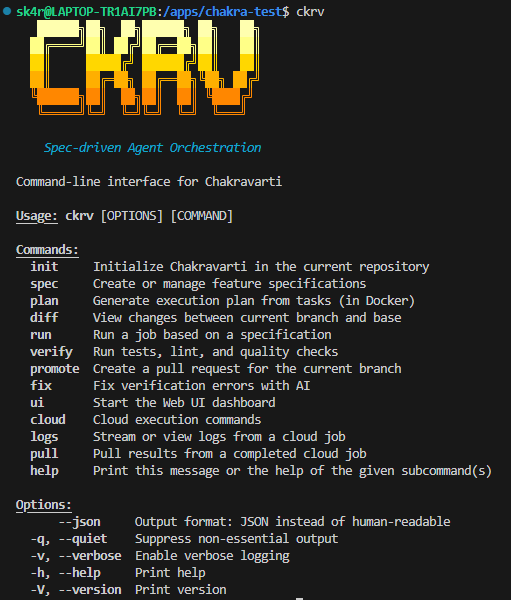
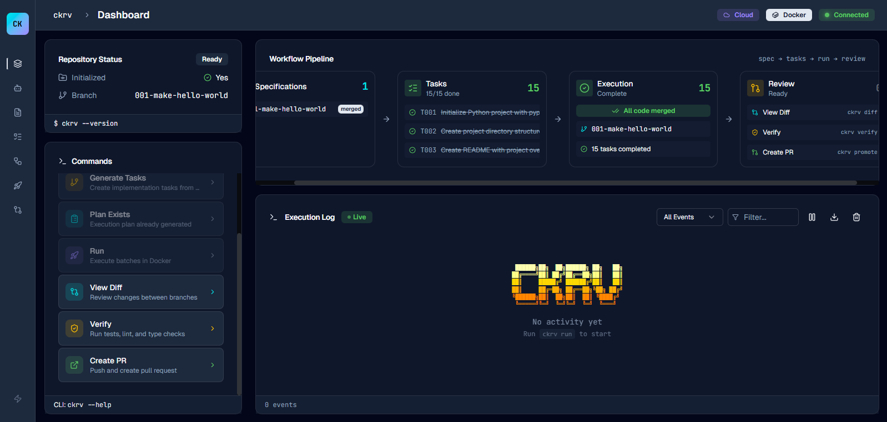

<h1 align="center">Chakravarti CLI</h1>

<p align="center">
  <strong>Spec-driven Agent Orchestration Engine</strong><br>
  <em>Code like an Architect, not a Typist.</em>
</p>

<p align="center">
  <a href="https://www.rust-lang.org/"></a>
  <a href="LICENSE"></a>
  <a href="https://deepwiki.com/FnSK4R17s/chakravarti-cli"></a>
</p>

---

Chakravarti (`ckrv`) is an autonomous coding engine that transforms high-level specifications into shipping code. It orchestrates AI agents across isolated Git worktrees and Docker sandboxes to ensure safety and code integrity.

## Installation

```bash
# Clone and install
git clone https://github.com/FnSK4R17s/chakravarti-cli.git
cd chakravarti-cli
make install
```

This builds the Rust binary, Docker agent images, and links `ckrv` globally via npm.

## Quick Start

```bash
# Initialize in your repository
ckrv init

# Create a spec from description
ckrv spec new "Add user authentication with OAuth2"

# Generate implementation tasks
ckrv spec tasks

# Generate execution plan
ckrv plan

# Execute orchestration
ckrv run

# Review and promote
ckrv diff
ckrv verify
ckrv promote --push --open
```

<p align="center">
  
</p>

## Commands

| Command | Description |
|---------|-------------|
| `ckrv init` | Initialize Chakravarti in the current repository |
| `ckrv spec` | Manage specifications (new, list, show, tasks) |
| `ckrv plan` | Generate or view execution plans |
| `ckrv run` | Execute orchestration (Plan → Execute → Merge) |
| `ckrv diff` | View changes between branches |
| `ckrv verify` | Run tests, linting, and type checking |
| `ckrv fix` | Use AI to fix verification errors |
| `ckrv promote` | Push changes and create a Pull Request |
| `ckrv status` | Show current workflow status |
| `ckrv logs` | View execution logs |
| `ckrv report` | Generate execution report |
| `ckrv task` | Manage individual tasks (list, show, retry) |
| `ckrv pull` | Pull changes from remote |
| `ckrv ui` | Launch the Web UI dashboard |
| `ckrv cloud` | Cloud execution commands (auth, sync, status) |

See [CLI Commands Reference](crates/docs/cli-commands.md) for full documentation.

## Web UI

Launch the interactive dashboard:

```bash
ckrv ui --port 3000
```

<p align="center">
  
</p>

## Architecture

```
crates/
├── ckrv-cli          # CLI entry point, command handlers
├── ckrv-core         # Orchestration engine, domain types
├── ckrv-git          # Git operations, worktree management
├── ckrv-sandbox      # Docker execution, agent providers
├── ckrv-spec         # Spec file loading and validation
├── ckrv-model        # LLM provider abstraction, routing
├── ckrv-metrics      # Telemetry and metrics collection
├── ckrv-verify       # Code verification (lint, test, typecheck)
├── ckrv-integrations # External service integrations (GitHub)
└── ckrv-ui           # Web dashboard server and frontend
```

See [Architecture Documentation](crates/docs/architecture.md) for diagrams and details.

## Agents

Chakravarti uses Claude Code CLI as the execution interface, with support for multiple AI backends:

### Currently Supported

| Agent Type | Description |
|------------|-------------|
| Claude Code (Native) | Default - uses Anthropic's Claude directly |
| Claude + OpenRouter | Use 12+ models via Claude Code CLI (Gemini, Kimi K2, DeepSeek, etc.) |
| GLM Coding Plan | Z.AI's GLM-4.7 and GLM-4.5-Air via Claude Code CLI |
| OpenAI Codex | Native Codex CLI integration |

### Future Integrations

The following agents are planned for future releases:

- **Gemini CLI** - Google's Gemini models
- **Cursor CLI** - Cursor's AI coding assistant
- **Amp** - Sourcegraph's Amp agent
- **Qwen Code** - Alibaba's Qwen coding models
- **Opencode** - Open source coding CLI
- **Factory Droid** - Factory's autonomous developer
- **GitHub Copilot** - GitHub Copilot via CLI

See [Agent Guide](crates/docs/agent-guide.md) for adding new agents.

## Development

```bash
# Build all crates
cargo build --workspace

# Run tests
cargo test --workspace

# Install locally
cargo install --path crates/ckrv-cli

# Run UI in development
cd crates/ckrv-ui/frontend && npm run dev
```

See [Getting Started](crates/docs/getting-started.md) for full setup instructions.

## Requirements

- **Rust** 1.75+
- **Docker** (for sandboxed execution)
- **Git** 2.20+
- **Node.js** 18+ (for UI development)

## Documentation

| Document | Description |
|----------|-------------|
| [Architecture](crates/docs/architecture.md) | System design and crate dependencies |
| [Getting Started](crates/docs/getting-started.md) | New contributor onboarding |
| [CLI Commands](crates/docs/cli-commands.md) | Complete command reference |
| [Agent Guide](crates/docs/agent-guide.md) | Adding new AI agents |

## License

MIT License - see [LICENSE](LICENSE) for details.
