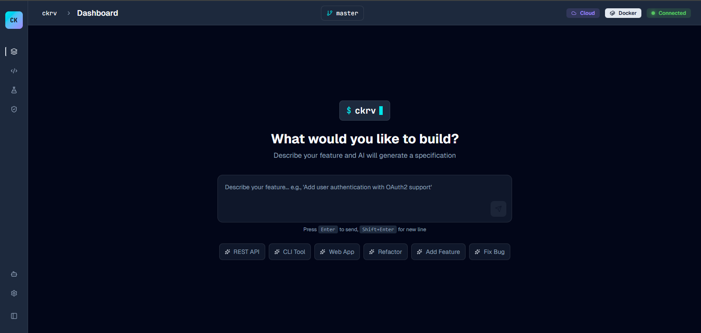

<p align="center">
  
</p>

<h1 align="center">Chakravarti-cli</h1>

<p align="center">
  <strong>Cross-Platform Orchestration Engine for AI Coding Agents</strong><br>
  <em>Use all your AI coding subscriptions together.</em><br>
  <sub>You write specs. Your agents implement them. Together.</sub>
</p>

<p align="center">
  <a href="https://www.rust-lang.org/"></a>
  <a href="LICENSE"></a>
  <a href="https://deepwiki.com/FnSK4R17s/chakravarti-cli"></a>
</p>

---

**Chakravarti-cli (`ckrv`)** is a cross-platform orchestration engine for AI coding agents.

You write specifications. `ckrv` coordinates multiple AI agents—Claude Code, Codex, Kilo Code, and others—to implement them in parallel. You pay for multiple AI coding subscriptions but can't use them together? *Finally, someone built this.*

The companies behind these tools will never build cross-provider support themselves. Anthropic won't help you use Codex. OpenAI won't integrate Claude. `ckrv` lives in the gap between their incentives—it's the only tool that lets you use all your AI subscriptions together.

Each spec generates a complete workflow—from **scope** to **plan** to **implementation**—with full control to review and refine at every stage. All execution happens in Docker sandboxes on isolated Git worktrees for safety and code integrity.

> [!WARNING]
> **🚧 Beta Software** — This project is under active development. Workflows and commands may be incomplete or broken. Your feedback helps make this better!
>
> 💬 **Have feedback or found a bug?** Reach out at [**@_Shikh4r_** on X](https://x.com/_Shikh4r_)

## Installation

```bash
# Clone and install
git clone https://github.com/FnSK4R17s/chakravarti-cli.git
cd chakravarti-cli

# Quick install (recommended for containers/dev environments - no Docker needed)
just install-quick

# Or full install (includes Docker agent images)
just install
```

### Install Options

| Command | Docker Images | Use Case |
|---------|---------------|----------|
| `just install-quick` | Skipped | Containers, dev environments, CI without Docker |
| `just install` | Built | Local development with full agent support |
| `CKRV_SKIP_DOCKER=true just install` | Skipped | Environment variable override |

> **Note**: If you don't have `just` installed, run `make install` which will prompt you to install it. See [just installation](https://github.com/casey/just#installation).

## Quick Start

```bash
# Initialize in your repository
ckrv init

# Create a spec from description
ckrv spec new "Add user authentication with OAuth2"

# Generate implementation tasks
ckrv spec tasks

# Generate execution plan
ckrv plan

# Execute orchestration
ckrv run

# Review and promote
ckrv diff
ckrv verify
ckrv promote --push --open
```

<p align="center">
  
</p>

## Commands

| Command | Description |
|---------|-------------|
| `ckrv init` | Initialize Chakravarti in the current repository |
| `ckrv spec` | Manage specifications (new, clarify, design, tasks, validate, list) |
| `ckrv plan` | Generate execution plan from tasks (in Docker) |
| `ckrv run` | Execute orchestration (Plan → Execute → Merge) |
| `ckrv diff` | View changes between branches |
| `ckrv verify` | Run tests, linting, and type checking |
| `ckrv test` | Run, plan, and write tests using AI agents |
| `ckrv qa` | QA code review and bug analysis |
| `ckrv fix` | Use AI to fix verification errors |
| `ckrv promote` | Push changes and create a Pull Request |
| `ckrv term` | Spawn interactive AI agent terminal |
| `ckrv logs` | Stream or view cloud job logs |
| `ckrv pull` | Pull results from completed cloud jobs |
| `ckrv ui` | Launch the Web UI dashboard |
| `ckrv cloud` | Cloud execution (login, logout, whoami, credentials) |

See [CLI Commands Reference](crates/docs/cli-commands.md) for full documentation.

## Web UI

Launch the interactive dashboard:

```bash
ckrv ui --port 3000
```

<p align="center">
  
</p>

## Architecture

```
crates/
├── ckrv-cli          # CLI entry point, command handlers
├── ckrv-core         # Orchestration engine, domain types
├── ckrv-git          # Git operations, worktree management
├── ckrv-sandbox      # Docker execution, agent providers
├── ckrv-spec         # Spec file loading and validation
├── ckrv-mcp          # MCP server for AI agent integration
├── ckrv-transport    # Shared HTTP API types for web/desktop
├── ckrv-tauri        # Tauri desktop application
├── ckrv-model        # LLM provider abstraction (⚠️ unused)
├── ckrv-metrics      # Cost/time tracking, file storage
├── ckrv-verify       # Test execution and parsing (⚠️ unused)
├── ckrv-integrations # External integrations stub (⚠️ stub)
└── ckrv-ui           # Web dashboard server and frontend
```

See [Architecture Documentation](crates/docs/architecture.md) for diagrams and details.

## Agents

Chakravarti orchestrates multiple AI coding agents, each running in isolated Docker sandboxes:

### Currently Supported

| 🤖 Tool | 🔑 Authentication | 📍 Availability | Description |
|---------|-------------------|-----------------|-------------|
| Claude Code | Claude Subscription | CLI + UI | Default — uses Anthropic's Claude directly |
| Claude Code | OpenRouter API | CLI + UI | 12+ models (Gemini, DeepSeek, Qwen, Kimi K2, etc.) |
| Claude Code | GLM Coding Plan | CLI + UI | Z.AI's GLM-4.7 and GLM-4.5-Air |
| Codex | OpenAI Subscription | CLI + UI | Native Codex CLI integration |
| Kilo Code | File-based auth | CLI + UI | 30+ AI providers (Gemini, DeepSeek, Mistral, Qwen, etc.) |
| Opencode | File-based auth | CLI + UI | Open-source coding CLI integration |

### Future Integrations

The following agents are planned for future releases:

- **Gemini CLI** - Google's Gemini models ([#31](https://github.com/FnSK4R17s/chakravarti-cli/issues/31))
- **Cursor CLI** - Cursor's AI coding assistant ([#32](https://github.com/FnSK4R17s/chakravarti-cli/issues/32))
- **Amp** - Ampcode AI coding agent ([#33](https://github.com/FnSK4R17s/chakravarti-cli/issues/33))
- **Qwen Code** - Alibaba's Qwen coding models ([#34](https://github.com/FnSK4R17s/chakravarti-cli/issues/34))
- **Opencode** - ✅ Now supported in current release ([#35](https://github.com/FnSK4R17s/chakravarti-cli/issues/35))
- **Factory Droid** - Factory's autonomous developer ([#36](https://github.com/FnSK4R17s/chakravarti-cli/issues/36))
- **GitHub Copilot** - GitHub Copilot via CLI ([#37](https://github.com/FnSK4R17s/chakravarti-cli/issues/37))
- **Mistral Vibe** - Mistral AI's coding assistant ([#29](https://github.com/FnSK4R17s/chakravarti-cli/issues/29))

See [Agent Guide](crates/docs/agent-guide.md) for adding new agents.

## Development

```bash
# Build all crates
just build

# Run tests
just test

# Run linters
just lint

# Install locally (skip Docker)
just install-quick

# Run UI in development
just ui-dev
```

See [Getting Started](crates/docs/getting-started.md) for full setup instructions.

## Requirements

- **Rust** 1.75+
- **Docker** (for sandboxed execution)
- **Git** 2.20+
- **Node.js** 18+ (for UI development)

## Documentation

| Document | Description |
|----------|-------------|
| [Architecture](crates/docs/architecture.md) | System design and crate dependencies |
| [Getting Started](crates/docs/getting-started.md) | New contributor onboarding |
| [CLI Commands](crates/docs/cli-commands.md) | Complete command reference |
| [Agent Guide](crates/docs/agent-guide.md) | Adding new AI agents |

## License

MIT License - see [LICENSE](LICENSE) for details.
