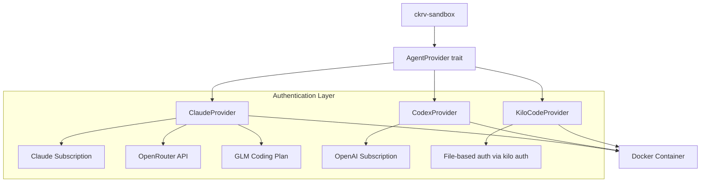

# Agent Extensibility Guide

> **Full-stack integration?** This guide covers the sandbox/provider layer. For the complete cross-crate playbook — including both backends (Axum + Tauri), frontend UI, type generation, endpoint parity, and Docker — see **[Agent Integration Playbook](agent-integration-playbook.md)**.

## Overview

Chakravarti CLI supports multiple AI agents through the `AgentProvider` trait. This guide explains how agents are structured and how to add new ones.

## Agentic Coding Tools

These are the underlying CLI tools that execute code generation:

| Tool | Provider | Description |
|------|----------|-------------|
| **Claude Code** | Anthropic | Native agentic coding CLI |
| **Codex** | OpenAI | OpenAI's coding assistant CLI |
| **Kilo Code** | Multi-provider | Open-source CLI supporting 30+ AI providers |
| **Gemini CLI** | Google | Google's first-party Gemini coding assistant CLI |

## Authentication Methods

Each tool can be authenticated in different ways:

| Tool | Authentication | Environment/Config |
|------|----------------|-------------------|
| Claude Code | Claude Subscription | `~/.claude.json`, `~/.claude/` |
| Claude Code | OpenRouter API Key | `ANTHROPIC_BASE_URL`, `ANTHROPIC_AUTH_TOKEN` |
| Claude Code | GLM Coding Plan (Z.AI) | `ZAI_API_KEY`, `ANTHROPIC_BASE_URL` |
| Codex | OpenAI Subscription | `~/.codex/`, `OPENAI_API_KEY` |
| Kilo Code | File-based auth | `~/.config/kilo/config.json` (configured via `kilo auth`) |
| Gemini CLI | API key + file auth | `GEMINI_API_KEY`, optionally `~/.gemini/` |

> **Note**: OpenRouter and GLM Coding Plan use Claude Code as the execution interface, allowing you to access various models (Gemini, DeepSeek, Qwen, GLM, etc.) through their respective APIs.

## Where Agent Support Lives

| Crate | Responsibility |
|-------|----------------|
| `ckrv-sandbox` | `AgentProvider` trait, Claude/Codex/Kilo/Gemini providers, Docker execution |
| `ckrv-core` | `RunnerConfig` with OpenRouter and GLM fields |
| `ckrv-cli` | Agent config loading, CLI flags |
| `ckrv-ui` | Full agent management UI, GLM/OpenRouter config |

> [!NOTE]
> Both GLM Coding Plan and OpenRouter are now supported in both CLI and UI. Configure agents in `~/.config/chakravarti/agents.yaml` for CLI usage, or use the Agent Manager in `ckrv ui`.

## Agent Architecture



## The AgentProvider Trait

```rust
pub trait AgentProvider: Send + Sync {
    /// Human-readable name for logging and UI
    fn name(&self) -> &str;

    /// Get the agent type enum
    fn agent_type(&self) -> AgentType;

    /// Construct CLI command for execution
    /// Returns: [command, arg1, arg2, ...]
    fn build_command(
        &self,
        prompt: &str,
        workdir: &Path,
        config: &AgentConfig
    ) -> Vec<String>;

    /// Required environment variables
    /// e.g., ["ANTHROPIC_API_KEY"]
    fn required_env_vars(&self) -> Vec<&str>;

    /// Docker mounts for config files
    fn config_mounts(
        &self,
        host_home: &str,
        container_home: &str
    ) -> Vec<Mount>;

    /// Parse agent output into normalized format
    fn parse_output(
        &self,
        stdout: &str,
        stderr: &str,
        exit_code: i32
    ) -> Result<AgentOutput>;
}
```

## Adding a New Agent

### Step 1: Add AgentType Variant

Edit `crates/ckrv-sandbox/src/agent/mod.rs`:

```rust
#[derive(Debug, Clone, Copy, PartialEq, Eq, Default)]
pub enum AgentType {
    #[default]
    Claude,
    Codex,
    YourAgent,  // Add new variant
}

impl AgentType {
    pub fn from_str(s: &str) -> Option<Self> {
        match s.to_lowercase().as_str() {
            "claude" | "claude-code" => Some(Self::Claude),
            "codex" | "openai" => Some(Self::Codex),
            "youragent" => Some(Self::YourAgent),  // Add parsing
            _ => None,
        }
    }
}
```

### Step 2: Create Provider Implementation

Create `crates/ckrv-sandbox/src/agent/youragent.rs`:

```rust
use super::{AgentConfig, AgentOutput, AgentProvider, AgentType};
use anyhow::Result;
use bollard::models::Mount;
use std::path::Path;

pub struct YourAgentProvider {
    // Config fields
}

impl YourAgentProvider {
    pub fn new() -> Self {
        Self { /* ... */ }
    }
}

impl AgentProvider for YourAgentProvider {
    fn name(&self) -> &str {
        "Your Agent"
    }

    fn agent_type(&self) -> AgentType {
        AgentType::YourAgent
    }

    fn build_command(
        &self,
        prompt: &str,
        workdir: &Path,
        config: &AgentConfig
    ) -> Vec<String> {
        // Construct agent CLI command
        vec![
            "your-agent-cli".to_string(),
            "--prompt".to_string(),
            prompt.to_string(),
            "--workdir".to_string(),
            workdir.to_string_lossy().to_string(),
        ]
    }

    fn required_env_vars(&self) -> Vec<&str> {
        vec!["YOUR_AGENT_API_KEY"]
    }

    fn config_mounts(
        &self,
        host_home: &str,
        container_home: &str
    ) -> Vec<Mount> {
        vec![Mount {
            target: Some(format!("{container_home}/.youragent")),
            source: Some(format!("{host_home}/.youragent")),
            typ: Some(bollard::models::MountTypeEnum::BIND),
            read_only: Some(true),
            ..Default::default()
        }]
    }

    fn parse_output(
        &self,
        stdout: &str,
        stderr: &str,
        exit_code: i32
    ) -> Result<AgentOutput> {
        Ok(AgentOutput {
            success: exit_code == 0,
            stdout: stdout.to_string(),
            stderr: stderr.to_string(),
            exit_code,
        })
    }
}
```

### Step 3: Register in Factory

Update `create_agent()` in `mod.rs`:

```rust
pub fn create_agent(agent_type: AgentType) -> Box<dyn AgentProvider> {
    match agent_type {
        AgentType::Claude => Box::new(ClaudeProvider::new()),
        AgentType::Codex => Box::new(CodexProvider::new()),
        AgentType::YourAgent => Box::new(YourAgentProvider::new()),
    }
}
```

### Step 4: Add to Docker Image

If your agent requires a CLI, create a Dockerfile in `docker/`. Use the GHCR naming convention `ghcr.io/fnsk4r17s/ckrv-<agent>:latest` (e.g., `ckrv-claude`, `ckrv-codex`, `ckrv-kilo`). The `docker.rs` module defines `GHCR_PREFIX` (`ghcr.io/fnsk4r17s`) and a `DEFAULT_IMAGE` (`ghcr.io/fnsk4r17s/ckrv-agent:latest`). Use `DockerClient::set_image()` to override the image per agent type.

```dockerfile
FROM node:22-slim

# Install system dependencies (as root)
RUN apt-get update && apt-get install -y \
    git curl ca-certificates \
    && rm -rf /var/lib/apt/lists/*

# Install your agent CLI (as root)
RUN npm install -g your-agent-cli

# Create non-root user — REQUIRED
# Many agent CLIs (e.g., Claude Code) refuse to run certain flags as root.
# Always create a dedicated user and switch to it.
RUN useradd -m -s /bin/bash -d /home/youragent youragent && \
    mkdir -p /home/youragent/.youragent && \
    chown -R youragent:youragent /home/youragent

# Create workspace with correct ownership
RUN mkdir -p /workspace && chown youragent:youragent /workspace

WORKDIR /workspace
ENV HOME=/home/youragent

# Verify install (before USER switch, still root)
RUN your-agent-cli --version || true

# Switch to non-root user
USER youragent

CMD ["/bin/bash"]
```

> **Warning**: Always include a `USER` directive in your Dockerfile.
> Running as root causes agent CLIs to reject security-sensitive flags.
> For example, Claude Code blocks `--dangerously-skip-permissions` when
> running as root/sudo for security reasons.

### Step 5: Add Tests

Create tests in `crates/ckrv-sandbox/src/agent/tests.rs`:

```rust
#[test]
fn test_youragent_build_command() {
    let provider = YourAgentProvider::new();
    let config = AgentConfig::new(AgentType::YourAgent);
    let cmd = provider.build_command(
        "test prompt",
        Path::new("/workspace"),
        &config
    );
    assert!(cmd[0].contains("your-agent"));
}
```

## Configuration

Agents are configured in `.chakravarti/agents.yaml`:

```yaml
agents:
  - id: your-agent
    name: Your Agent
    agent_type: youragent
    enabled: true
    description: Your agent description
```

## OpenRouter Integration

For API-based agents via OpenRouter:

```yaml
agents:
  - id: model-via-openrouter
    name: Model Name
    agent_type: claude_openrouter
    openrouter:
      model: provider/model-name
      api_key: sk-or-...
```

## GLM Coding Plan Integration

For Z.AI GLM Coding Plan agents:

```yaml
agents:
  - id: my-glm-agent
    name: GLM Coding Plan Agent
    agent_type: claude_glm
    glm:
      api_key: your-zai-api-key
      model: glm-4.7
      timeout_ms: 3000000  # Optional, defaults to 3000000 (50 minutes)
```

**Usage via CLI:**

```bash
# Run a task with GLM agent
ckrv task run --agent "my-glm-agent" -p "Create hello.txt"

# Full workflow execution with GLM agent
ckrv run --executor-model my-glm-agent
```

The GLM configuration sets the following environment variables for Claude Code:

| Variable | Value |
|----------|-------|
| `ANTHROPIC_BASE_URL` | `https://api.z.ai/api/anthropic` |
| `ANTHROPIC_AUTH_TOKEN` | Your Z.AI API key |
| `API_TIMEOUT_MS` | Custom timeout (default: 3000000) |

## Kilo Code Integration

Kilo Code is an open-source, multi-provider agentic CLI that supports 30+ AI providers (Gemini, DeepSeek, Mistral, Qwen, etc.) through a single interface.

**Prerequisites:**

```bash
# Install Kilo Code CLI
npm install -g @kilocode/cli

# Configure credentials (interactive)
kilo auth
```

**Configuration:**

```yaml
agents:
  - id: kilo-agent
    name: Kilo Code
    agent_type: kilo_code
    enabled: true
    description: Multi-provider agentic coding
```

**Usage via CLI:**

```bash
# Run a task with Kilo agent
ckrv task run --agent kilo-agent -p "Create hello.txt"

# Spawn interactive Kilo terminal
ckrv term --agent kilo-agent
```

**Streaming Output:**

Kilo supports two output formats via `--format`:

| Format | Flag | Description |
|--------|------|-------------|
| `default` | `--format default` | Human-readable formatted text |
| `json` | `--format json` | Structured NDJSON events with cost/token metadata |

JSON events include types: `step_start`, `tool_use`, `text`, `step_finish`.

**Supported Providers:** See [Kilo Code Provider Configuration](https://github.com/Kilo-Org/kilocode/blob/main/cli/docs/PROVIDER_CONFIGURATION.md) for the full list of 30+ supported providers.

**Key Differences from Claude/Codex:**

| Feature | Claude/Codex | Kilo Code |
|---------|-------------|------------|
| Auth | Env vars | File-based (`~/.config/kilo/`) |
| Execution | `--print` | `--auto` |
| Model selection | Env vars / `--model` | `--model provider/model` |
| Streaming | `--output-format stream-json` | `--format json` (NDJSON) |

## Gemini CLI Integration

Gemini CLI can run through Chakravarti as a first-class agent provider.

**Configuration:**

```yaml
agents:
  - id: gemini-agent
    name: Gemini CLI
    agent_type: gemini
    enabled: true
    description: Google Gemini coding assistant
```

**Usage via CLI:**

```bash
ckrv task run --agent gemini-agent -p "Create hello.txt"
ckrv term --agent gemini-agent
```

**Auth + Mounts:**
- `GEMINI_API_KEY` is passed into the container when available
- `~/.gemini/` is mounted into `/home/gemini/.gemini`
- `~/.config/google/` is mounted into `/home/gemini/.config/google`

## Best Practices

1. **Fail fast**: Return errors early from `build_command`
2. **Normalize output**: Parse agent-specific output in `parse_output`
3. **Minimal mounts**: Only mount required config files
4. **Test locally**: Use `LocalSandbox` for development
