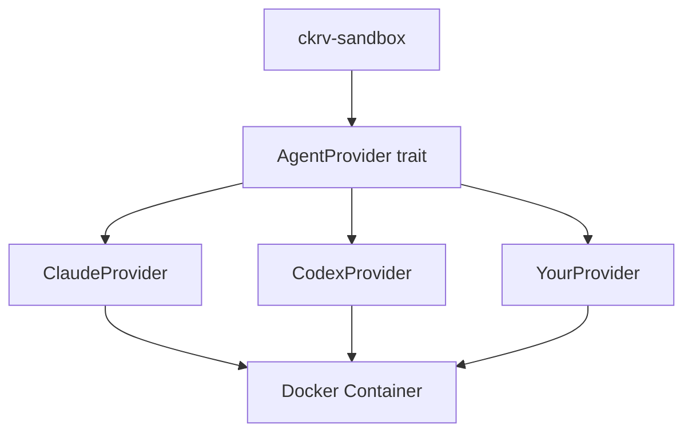

# Agent Extensibility Guide

## Overview

Chakravarti CLI supports multiple AI agents through the `AgentProvider` trait. This guide explains how to add support for new agents.

## Supported Agents

| Agent | Type | Status |
|-------|------|--------|
| Claude Code | Native CLI | ✅ Default |
| OpenAI Codex | Native CLI | ✅ Supported |
| OpenRouter Models | Via Claude Code CLI | ✅ Supported |

> **Note**: OpenRouter integration uses the Claude Code CLI as the interface, allowing you to plug in multiple AI models (Gemini, Kimi K2, DeepSeek, Qwen, etc.) through OpenRouter's API.

## Agent Architecture



## The AgentProvider Trait

```rust
pub trait AgentProvider: Send + Sync {
    /// Human-readable name for logging and UI
    fn name(&self) -> &str;

    /// Get the agent type enum
    fn agent_type(&self) -> AgentType;

    /// Construct CLI command for execution
    /// Returns: [command, arg1, arg2, ...]
    fn build_command(
        &self,
        prompt: &str,
        workdir: &Path,
        config: &AgentConfig
    ) -> Vec<String>;

    /// Required environment variables
    /// e.g., ["ANTHROPIC_API_KEY"]
    fn required_env_vars(&self) -> Vec<&str>;

    /// Docker mounts for config files
    fn config_mounts(
        &self,
        host_home: &str,
        container_home: &str
    ) -> Vec<Mount>;

    /// Parse agent output into normalized format
    fn parse_output(
        &self,
        stdout: &str,
        stderr: &str,
        exit_code: i32
    ) -> Result<AgentOutput>;
}
```

## Adding a New Agent

### Step 1: Add AgentType Variant

Edit `crates/ckrv-sandbox/src/agent/mod.rs`:

```rust
#[derive(Debug, Clone, Copy, PartialEq, Eq, Default)]
pub enum AgentType {
    #[default]
    Claude,
    Codex,
    YourAgent,  // Add new variant
}

impl AgentType {
    pub fn from_str(s: &str) -> Option<Self> {
        match s.to_lowercase().as_str() {
            "claude" | "claude-code" => Some(Self::Claude),
            "codex" | "openai" => Some(Self::Codex),
            "youragent" => Some(Self::YourAgent),  // Add parsing
            _ => None,
        }
    }
}
```

### Step 2: Create Provider Implementation

Create `crates/ckrv-sandbox/src/agent/youragent.rs`:

```rust
use super::{AgentConfig, AgentOutput, AgentProvider, AgentType};
use anyhow::Result;
use bollard::models::Mount;
use std::path::Path;

pub struct YourAgentProvider {
    // Config fields
}

impl YourAgentProvider {
    pub fn new() -> Self {
        Self { /* ... */ }
    }
}

impl AgentProvider for YourAgentProvider {
    fn name(&self) -> &str {
        "Your Agent"
    }

    fn agent_type(&self) -> AgentType {
        AgentType::YourAgent
    }

    fn build_command(
        &self,
        prompt: &str,
        workdir: &Path,
        config: &AgentConfig
    ) -> Vec<String> {
        // Construct agent CLI command
        vec![
            "your-agent-cli".to_string(),
            "--prompt".to_string(),
            prompt.to_string(),
            "--workdir".to_string(),
            workdir.to_string_lossy().to_string(),
        ]
    }

    fn required_env_vars(&self) -> Vec<&str> {
        vec!["YOUR_AGENT_API_KEY"]
    }

    fn config_mounts(
        &self,
        host_home: &str,
        container_home: &str
    ) -> Vec<Mount> {
        vec![Mount {
            target: Some(format!("{container_home}/.youragent")),
            source: Some(format!("{host_home}/.youragent")),
            typ: Some(bollard::models::MountTypeEnum::BIND),
            read_only: Some(true),
            ..Default::default()
        }]
    }

    fn parse_output(
        &self,
        stdout: &str,
        stderr: &str,
        exit_code: i32
    ) -> Result<AgentOutput> {
        Ok(AgentOutput {
            success: exit_code == 0,
            stdout: stdout.to_string(),
            stderr: stderr.to_string(),
            exit_code,
        })
    }
}
```

### Step 3: Register in Factory

Update `create_agent()` in `mod.rs`:

```rust
pub fn create_agent(agent_type: AgentType) -> Box<dyn AgentProvider> {
    match agent_type {
        AgentType::Claude => Box::new(ClaudeProvider::new()),
        AgentType::Codex => Box::new(CodexProvider::new()),
        AgentType::YourAgent => Box::new(YourAgentProvider::new()),
    }
}
```

### Step 4: Add to Docker Image

If your agent requires a CLI, add it to `docker/Dockerfile.agent`:

```dockerfile
# Install your agent CLI
RUN npm install -g your-agent-cli
# or
RUN pip install your-agent-cli
```

### Step 5: Add Tests

Create tests in `crates/ckrv-sandbox/src/agent/tests.rs`:

```rust
#[test]
fn test_youragent_build_command() {
    let provider = YourAgentProvider::new();
    let config = AgentConfig::new(AgentType::YourAgent);
    let cmd = provider.build_command(
        "test prompt",
        Path::new("/workspace"),
        &config
    );
    assert!(cmd[0].contains("your-agent"));
}
```

## Configuration

Agents are configured in `.chakravarti/agents.yaml`:

```yaml
agents:
  - id: your-agent
    name: Your Agent
    agent_type: youragent
    enabled: true
    description: Your agent description
```

## OpenRouter Integration

For API-based agents via OpenRouter:

```yaml
agents:
  - id: model-via-openrouter
    name: Model Name
    agent_type: claude_openrouter
    openrouter:
      model: provider/model-name
      api_key: sk-or-...
```

## Best Practices

1. **Fail fast**: Return errors early from `build_command`
2. **Normalize output**: Parse agent-specific output in `parse_output`
3. **Minimal mounts**: Only mount required config files
4. **Test locally**: Use `LocalSandbox` for development
