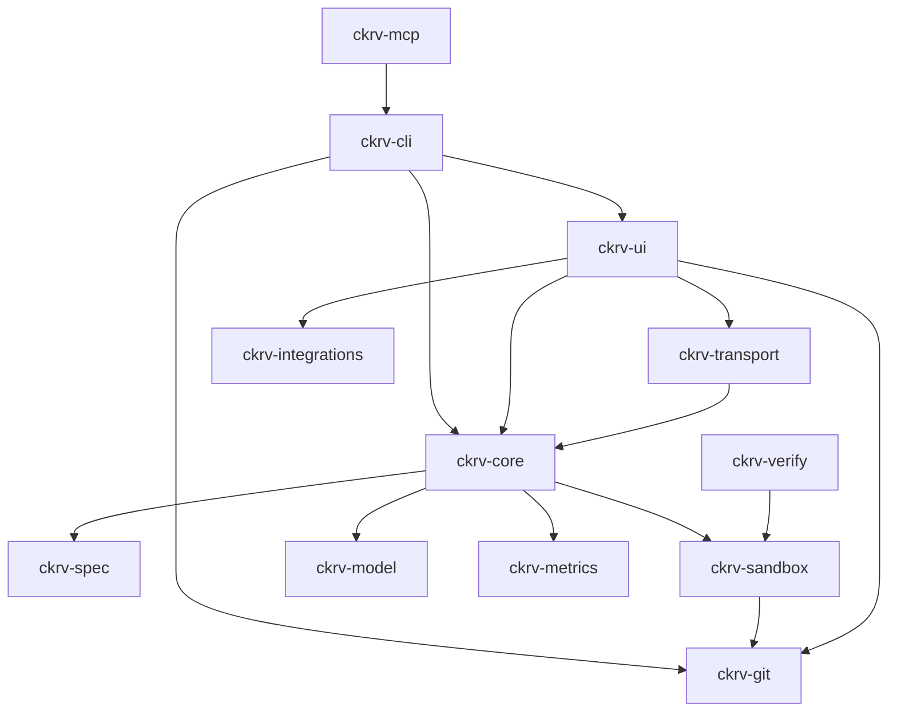
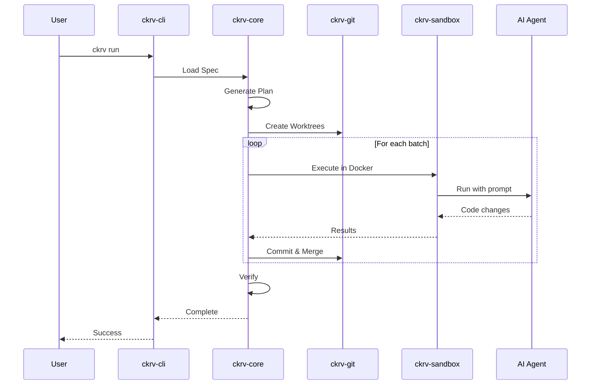

# Chakravarti CLI Architecture

## Overview

Chakravarti CLI is a spec-driven agent orchestration engine built in Rust. It transforms high-level specifications into shipping code by orchestrating AI agents across isolated Git worktrees.

## Crate Dependency Graph



## Crate Responsibilities

| Crate | Purpose | Status |
|-------|---------|--------|
| `ckrv-cli` | CLI entry point, command handlers, user prompts | ✅ Used |
| `ckrv-core` | Orchestration engine, workflow execution, domain types | ✅ Used |
| `ckrv-git` | Git operations, worktree management, branch handling | ✅ Used |
| `ckrv-sandbox` | Docker execution, agent providers, command allow-list | ✅ Used |
| `ckrv-spec` | Spec file loading, parsing, validation | ✅ Used |
| `ckrv-model` | LLM provider abstraction, routing, cost tracking | ⚠️ **Unused** |
| `ckrv-metrics` | Metrics collection, cost/time tracking, file storage | ✅ Used |
| `ckrv-verify` | Test execution, output parsing, acceptance checking | ⚠️ **Unused** |
| `ckrv-integrations` | External service integrations (GitHub, etc.) | ⚠️ **Stub** |
| `ckrv-ui` | Web dashboard server, REST API, WebSocket events | ✅ Used |
| `ckrv-transport` | Shared HTTP API types, handlers, and routes for web/desktop | ✅ Used |
| `ckrv-mcp` | MCP server exposing CLI commands as tools for AI agents | ✅ Used |

## Execution Flow



## Key Abstractions

### Spec → Plan → Job

```
Spec (what to build)
  ↓
Plan (how to build: phases, batches, tasks)
  ↓
Job (execution instance with attempts)
  ↓
Attempt (single execution run with results)
```

### Orchestrator

The `Orchestrator` trait defines the execution contract:

```rust
pub trait Orchestrator {
    fn run(&mut self, spec: Spec) -> OrchestratorResult;
    fn on_event(&self, handler: impl EventHandler);
}
```

### Sandbox

The `Sandbox` trait abstracts execution environments:

```rust
pub trait Sandbox {
    fn execute(&self, config: ExecuteConfig) -> ExecuteResult;
}

// Implementations:
// - DockerSandbox: Containerized execution
// - LocalSandbox: Direct execution (dev mode)
```

### Agent Provider

The `AgentProvider` trait enables multiple AI backends:

```rust
pub trait AgentProvider {
    fn execute(&self, task: &AgentTask) -> AgentOutput;
    fn is_available(&self) -> bool;
}

// Implementations:
// - Claude (native)
// - OpenAI Codex
// - OpenRouter Models (via Claude Code CLI)
```

## Data Flow

1. **Input**: User provides spec file or natural language description
2. **Planning**: AI generates structured plan with phases and tasks
3. **Isolation**: Each task executes in isolated Git worktree
4. **Execution**: Agent runs in Docker container with allow-listed commands
5. **Verification**: Tests and linting validate changes
6. **Integration**: Successful changes merge back to main branch
7. **Output**: Clean, tested, documented code

## Security Model

- All execution isolated via Docker containers
- Command allow-list prevents dangerous operations
- No network access unless explicitly configured
- Secrets injected via environment variables only
- Main branch never directly modified
