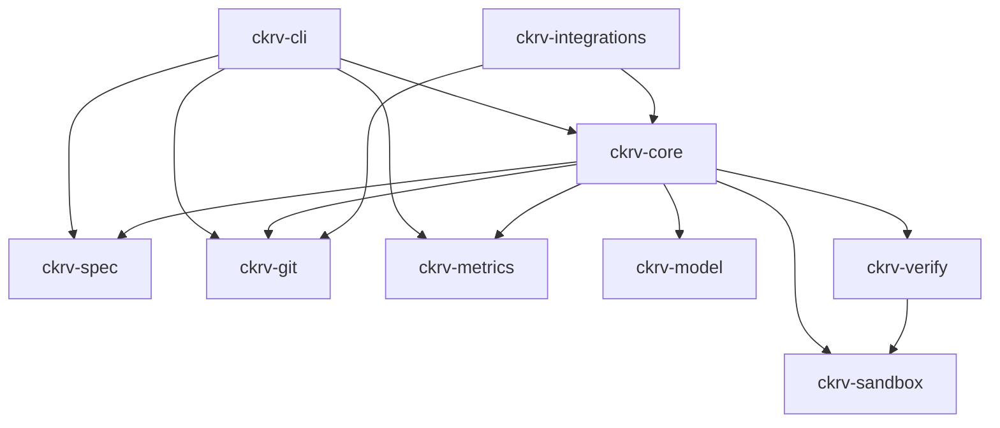

# Internal Crate Contracts: Chakravarti CLI

**Feature**: 001-cli-mvp  
**Date**: 2025-12-12

---

## Crate Dependency Graph



**Rule**: Dependencies flow inward (CLI → Core → specialized crates). No circular dependencies.

---

## ckrv-core

### `Orchestrator` Trait

```rust
/// Main orchestration interface
#[async_trait]
pub trait Orchestrator: Send + Sync {
    /// Create a new job from a spec
    async fn create_job(&self, spec: Spec, config: JobConfig) -> Result<Job>;
    
    /// Run a job to completion
    async fn run(&self, job_id: &str) -> Result<JobResult>;
    
    /// Get job status
    async fn status(&self, job_id: &str) -> Result<Job>;
    
    /// Cancel a running job
    async fn cancel(&self, job_id: &str) -> Result<()>;
    
    /// Subscribe to job events
    fn events(&self, job_id: &str) -> impl Stream<Item = JobEvent>;
}

pub struct JobResult {
    pub job: Job,
    pub diff: Option<String>,
    pub metrics: Metrics,
}

pub enum JobEvent {
    StateChanged(RunState),
    StepStarted { step_id: String },
    StepCompleted { step_id: String, duration: Duration },
    StepFailed { step_id: String, error: String },
    AttemptStarted { number: u32 },
    AttemptCompleted { number: u32, result: AttemptResult },
    MetricsUpdated(Metrics),
}
```

### `Planner` Trait

```rust
/// Plan generation interface
#[async_trait]
pub trait Planner: Send + Sync {
    /// Generate a plan from a spec
    async fn plan(&self, spec: &Spec, context: &PlanContext) -> Result<Plan>;
    
    /// Regenerate plan after failure
    async fn replan(
        &self,
        spec: &Spec,
        previous: &Plan,
        feedback: &str,
    ) -> Result<Plan>;
}

pub struct PlanContext {
    pub repo_path: PathBuf,
    pub file_listing: Vec<String>,
    pub previous_attempts: Vec<AttemptSummary>,
}
```

---

## ckrv-spec

### `SpecLoader` Trait

```rust
/// Spec file loading interface
pub trait SpecLoader: Send + Sync {
    /// Load a spec from a file path
    fn load(&self, path: &Path) -> Result<Spec>;
    
    /// List all specs in a directory
    fn list(&self, dir: &Path) -> Result<Vec<PathBuf>>;
    
    /// Validate a spec
    fn validate(&self, spec: &Spec) -> Result<ValidationResult>;
}

pub struct ValidationResult {
    pub valid: bool,
    pub errors: Vec<ValidationError>,
    pub warnings: Vec<ValidationWarning>,
}

pub struct ValidationError {
    pub field: String,
    pub message: String,
}
```

---

## ckrv-git

### `WorktreeManager` Trait

```rust
/// Git worktree management interface
pub trait WorktreeManager: Send + Sync {
    /// Create a new worktree for an attempt
    fn create(&self, job_id: &str, attempt_id: &str) -> Result<Worktree>;
    
    /// Get worktree path
    fn path(&self, job_id: &str, attempt_id: &str) -> Result<PathBuf>;
    
    /// Clean up a worktree
    fn cleanup(&self, worktree: &Worktree) -> Result<()>;
    
    /// List all worktrees
    fn list(&self) -> Result<Vec<Worktree>>;
}
```

### `DiffGenerator` Trait

```rust
/// Git diff generation interface
pub trait DiffGenerator: Send + Sync {
    /// Generate diff from worktree changes
    fn diff(&self, worktree: &Worktree) -> Result<Diff>;
    
    /// Get diff statistics
    fn diffstat(&self, worktree: &Worktree) -> Result<DiffStat>;
}

pub struct Diff {
    pub content: String,
    pub files: Vec<FileDiff>,
}

pub struct DiffStat {
    pub files_changed: usize,
    pub insertions: usize,
    pub deletions: usize,
}
```

### `BranchManager` Trait

```rust
/// Git branch management interface
pub trait BranchManager: Send + Sync {
    /// Create a branch from worktree
    fn create_from_worktree(
        &self,
        worktree: &Worktree,
        branch_name: &str,
        force: bool,
    ) -> Result<()>;
    
    /// Push branch to remote
    fn push(&self, branch_name: &str, remote: &str) -> Result<()>;
    
    /// Check if branch exists
    fn exists(&self, branch_name: &str) -> bool;
}
```

---

## ckrv-sandbox

### `Sandbox` Trait

```rust
/// Sandboxed execution interface
#[async_trait]
pub trait Sandbox: Send + Sync {
    /// Execute a command in the sandbox
    async fn execute(&self, config: ExecuteConfig) -> Result<ExecuteResult>;
    
    /// Check if sandbox runtime is available
    async fn health_check(&self) -> Result<()>;
}

pub struct ExecuteConfig {
    /// Command to run
    pub command: Vec<String>,
    
    /// Working directory inside sandbox
    pub workdir: PathBuf,
    
    /// Worktree to mount
    pub mount: PathBuf,
    
    /// Environment variables
    pub env: HashMap<String, String>,
    
    /// Timeout
    pub timeout: Duration,
}

pub struct ExecuteResult {
    pub exit_code: i32,
    pub stdout: String,
    pub stderr: String,
    pub duration: Duration,
}
```

### `AllowList` Trait

```rust
/// Tool allow-list interface
pub trait AllowList: Send + Sync {
    /// Check if a command is allowed
    fn is_allowed(&self, command: &[String]) -> bool;
    
    /// Get list of allowed commands
    fn allowed_commands(&self) -> &[String];
    
    /// Get list of blocked patterns
    fn blocked_patterns(&self) -> &[String];
}
```

---

## ckrv-model

### `ModelProvider` Trait

```rust
/// Model provider interface
#[async_trait]
pub trait ModelProvider: Send + Sync {
    /// Get provider name
    fn name(&self) -> &str;
    
    /// Get available models
    fn models(&self) -> &[ModelInfo];
    
    /// Generate completion
    async fn complete(&self, request: CompletionRequest) -> Result<CompletionResponse>;
}

pub struct CompletionRequest {
    pub model: String,
    pub messages: Vec<Message>,
    pub max_tokens: Option<u32>,
    pub temperature: Option<f32>,
}

pub struct CompletionResponse {
    pub content: String,
    pub usage: TokenUsage,
    pub model: String,
    pub finish_reason: FinishReason,
}

pub struct ModelInfo {
    pub id: String,
    pub name: String,
    pub pricing: ModelPricing,
    pub context_window: u32,
}

pub struct ModelPricing {
    pub input_per_1k: f64,
    pub output_per_1k: f64,
}
```

### `ModelRouter` Trait

```rust
/// Model selection logic
pub trait ModelRouter: Send + Sync {
    /// Select model for a step
    fn select(
        &self,
        step_type: StepType,
        context: &RoutingContext,
    ) -> String;
}

pub struct RoutingContext {
    pub optimize: OptimizeMode,
    pub attempt_number: u32,
    pub budget_remaining: Option<f64>,
    pub planner_override: Option<String>,
    pub executor_override: Option<String>,
}
```

---

## ckrv-verify

### `Verifier` Trait

```rust
/// Verification interface
#[async_trait]
pub trait Verifier: Send + Sync {
    /// Run verification on a worktree
    async fn verify(&self, config: VerifyConfig) -> Result<Verdict>;
}

pub struct VerifyConfig {
    /// Worktree to verify
    pub worktree: Worktree,
    
    /// Spec to check against
    pub spec: Spec,
    
    /// Test commands to run
    pub test_commands: Vec<String>,
    
    /// Sandbox for execution
    pub sandbox: Arc<dyn Sandbox>,
}
```

---

## ckrv-metrics

### `MetricsCollector` Trait

```rust
/// Metrics collection interface
pub trait MetricsCollector: Send + Sync {
    /// Record a timing event
    fn record_timing(&self, step_id: &str, duration: Duration);
    
    /// Record token usage
    fn record_tokens(&self, model: &str, usage: TokenUsage);
    
    /// Get current metrics
    fn current(&self) -> Metrics;
    
    /// Reset metrics for a new job
    fn reset(&self);
}

/// Metrics persistence
pub trait MetricsStorage: Send + Sync {
    /// Save metrics for a job
    fn save(&self, job_id: &str, metrics: &Metrics) -> Result<()>;
    
    /// Load metrics for a job
    fn load(&self, job_id: &str) -> Result<Metrics>;
}
```

---

## ckrv-integrations (Feature-Flagged)

### `GitLabClient` Trait

```rust
/// GitLab API client (behind feature flag)
#[cfg(feature = "gitlab")]
#[async_trait]
pub trait GitLabClient: Send + Sync {
    /// Create a merge request
    async fn create_mr(&self, config: MRConfig) -> Result<MRResponse>;
    
    /// Post a comment
    async fn post_comment(&self, mr_id: u64, body: &str) -> Result<()>;
}

#[cfg(feature = "gitlab")]
pub struct MRConfig {
    pub source_branch: String,
    pub target_branch: String,
    pub title: String,
    pub description: String,
}
```

---

## Error Types

Each crate defines its own error type using `thiserror`:

```rust
// ckrv-core
#[derive(Debug, thiserror::Error)]
pub enum CoreError {
    #[error("Spec not found: {0}")]
    SpecNotFound(String),
    
    #[error("Invalid state transition: {from:?} -> {to:?}")]
    InvalidStateTransition { from: RunState, to: RunState },
    
    #[error("Max attempts exceeded: {attempts}")]
    MaxAttemptsExceeded { attempts: u32 },
    
    // ... more variants
}

// ckrv-git
#[derive(Debug, thiserror::Error)]
pub enum GitError {
    #[error("Worktree creation failed: {0}")]
    WorktreeCreationFailed(String),
    
    #[error("Not a git repository: {0}")]
    NotARepo(PathBuf),
    
    // ... more variants
}
```

The CLI crate uses `anyhow` to wrap all errors for display.
