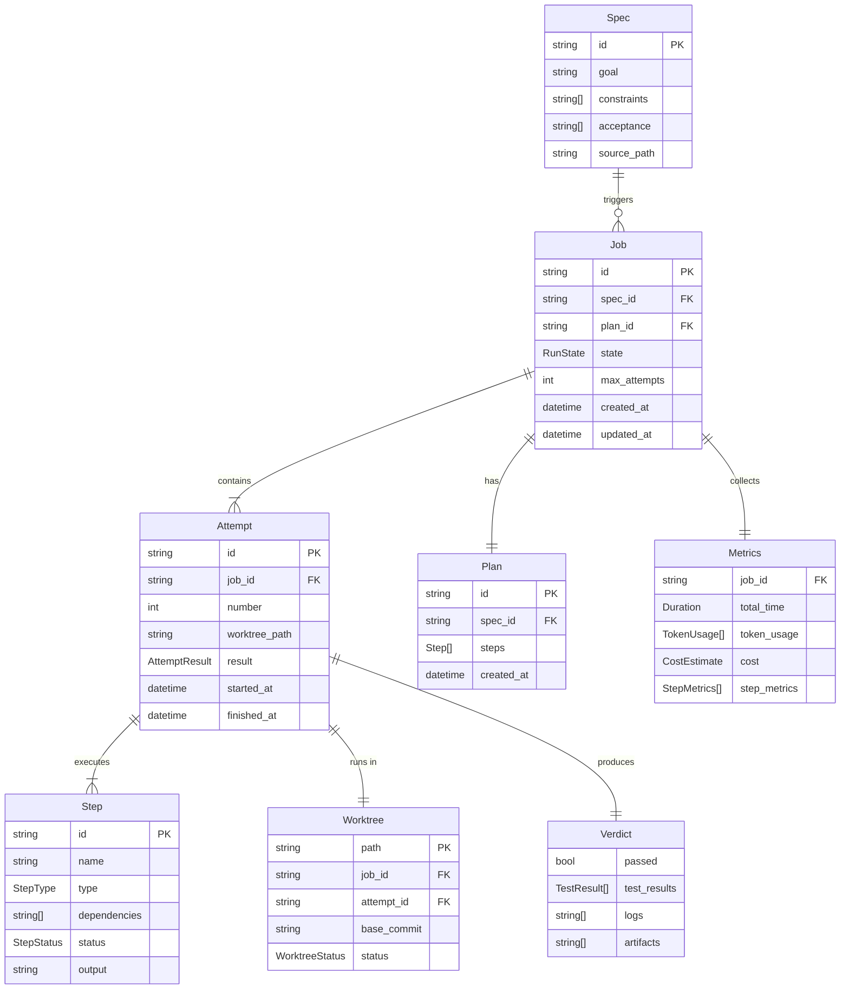
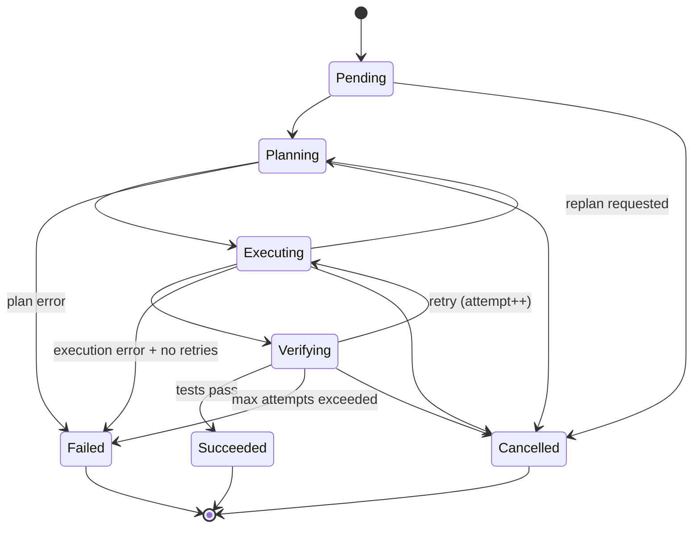

# Data Model: Chakravarti CLI MVP

**Feature**: 001-cli-mvp  
**Date**: 2025-12-12  
**Crate**: `ckrv-core`

---

## Entity Relationship Diagram



---

## Core Types

### Spec

The source of truth for a desired code change.

```rust
pub struct Spec {
    /// Unique identifier (e.g., "add_rate_limiter")
    pub id: String,
    
    /// Human-readable goal statement
    pub goal: String,
    
    /// Constraints that must be respected
    pub constraints: Vec<String>,
    
    /// Acceptance criteria to verify success
    pub acceptance: Vec<String>,
    
    /// Path to source file
    pub source_path: PathBuf,
}
```

**Validation Rules**:
- `id` must be non-empty, alphanumeric with underscores
- `goal` must be non-empty
- `acceptance` must have at least one criterion

---

### Plan

A deterministic DAG of execution steps generated by the planner model.

```rust
pub struct Plan {
    /// Unique identifier (UUID)
    pub id: String,
    
    /// Reference to source spec
    pub spec_id: String,
    
    /// Ordered list of steps (respects dependencies)
    pub steps: Vec<Step>,
    
    /// When the plan was generated
    pub created_at: DateTime<Utc>,
}
```

---

### Step

A single unit of work within a plan.

```rust
pub struct Step {
    /// Unique identifier within plan
    pub id: String,
    
    /// Human-readable name
    pub name: String,
    
    /// Type determines execution strategy
    pub step_type: StepType,
    
    /// IDs of steps that must complete first
    pub dependencies: Vec<String>,
    
    /// Current execution status
    pub status: StepStatus,
    
    /// Captured output/result
    pub output: Option<String>,
}

pub enum StepType {
    /// Analyze code/context (model call)
    Analyze,
    /// Generate code (model call)
    Generate,
    /// Execute command (sandbox)
    Execute,
    /// Run tests (verification)
    Test,
    /// Commit changes (git)
    Commit,
}

pub enum StepStatus {
    Pending,
    Running,
    Succeeded,
    Failed { error: String },
    Skipped { reason: String },
}
```

---

### Job

A single attempt to execute a spec, potentially with multiple retries.

```rust
pub struct Job {
    /// Unique identifier (UUID)
    pub id: String,
    
    /// Reference to source spec
    pub spec_id: String,
    
    /// Reference to generated plan
    pub plan_id: String,
    
    /// Current state in lifecycle
    pub state: RunState,
    
    /// Maximum retry attempts
    pub max_attempts: u32,
    
    /// All attempts made
    pub attempts: Vec<Attempt>,
    
    /// Configuration for this run
    pub config: JobConfig,
    
    pub created_at: DateTime<Utc>,
    pub updated_at: DateTime<Utc>,
}

pub struct JobConfig {
    /// Optimization mode
    pub optimize: OptimizeMode,
    
    /// Planner model override
    pub planner_model: Option<String>,
    
    /// Executor model override
    pub executor_model: Option<String>,
}

pub enum OptimizeMode {
    Cost,
    Time,
    Balanced,
}
```

---

### RunState

The job lifecycle state machine.

```rust
pub enum RunState {
    /// Job created, not yet started
    Pending,
    
    /// Generating plan from spec
    Planning,
    
    /// Executing plan steps
    Executing { attempt: u32, step: String },
    
    /// Running verification
    Verifying { attempt: u32 },
    
    /// Job completed successfully
    Succeeded { attempt: u32, diff_path: PathBuf },
    
    /// Job failed after all retries
    Failed { attempts: u32, last_error: String },
    
    /// Job was cancelled by user
    Cancelled,
}
```

**State Transitions**:



---

### Attempt

One execution cycle within a job.

```rust
pub struct Attempt {
    /// Unique identifier (UUID)
    pub id: String,
    
    /// Parent job
    pub job_id: String,
    
    /// Attempt number (1-indexed)
    pub number: u32,
    
    /// Path to worktree for this attempt
    pub worktree_path: PathBuf,
    
    /// Execution result
    pub result: AttemptResult,
    
    pub started_at: DateTime<Utc>,
    pub finished_at: Option<DateTime<Utc>>,
}

pub enum AttemptResult {
    /// Still running
    InProgress,
    
    /// All steps succeeded, verification passed
    Succeeded { diff: String },
    
    /// Verification failed
    VerificationFailed { verdict: Verdict },
    
    /// Execution error
    ExecutionFailed { step: String, error: String },
}
```

---

### Worktree

Git worktree for isolated execution.

```rust
pub struct Worktree {
    /// Absolute path to worktree
    pub path: PathBuf,
    
    /// Parent job
    pub job_id: String,
    
    /// Parent attempt
    pub attempt_id: String,
    
    /// Base commit SHA
    pub base_commit: String,
    
    /// Current status
    pub status: WorktreeStatus,
}

pub enum WorktreeStatus {
    Creating,
    Ready,
    InUse,
    Cleanup,
    Deleted,
}
```

---

### Verdict

Result of verification phase.

```rust
pub struct Verdict {
    /// Overall pass/fail
    pub passed: bool,
    
    /// Individual test results
    pub test_results: Vec<TestResult>,
    
    /// Captured logs
    pub logs: Vec<String>,
    
    /// Artifact paths (coverage reports, etc.)
    pub artifacts: Vec<PathBuf>,
}

pub struct TestResult {
    pub name: String,
    pub status: TestStatus,
    pub duration_ms: u64,
    pub output: Option<String>,
}

pub enum TestStatus {
    Passed,
    Failed,
    Skipped,
    Error,
}
```

---

### Metrics

Cost and time tracking.

```rust
pub struct Metrics {
    /// Parent job
    pub job_id: String,
    
    /// Total wall-clock time
    pub total_time: Duration,
    
    /// Token usage per model
    pub token_usage: Vec<TokenUsage>,
    
    /// Estimated cost
    pub cost: CostEstimate,
    
    /// Per-step metrics
    pub step_metrics: Vec<StepMetrics>,
    
    /// Retry count
    pub retry_count: u32,
}

pub struct TokenUsage {
    pub model: String,
    pub input_tokens: u64,
    pub output_tokens: u64,
}

pub struct CostEstimate {
    /// Estimated USD cost
    pub total_usd: f64,
    
    /// Breakdown by model
    pub by_model: HashMap<String, f64>,
}

pub struct StepMetrics {
    pub step_id: String,
    pub duration: Duration,
    pub tokens: Option<TokenUsage>,
}
```

---

## Serialization

All types derive `Serialize` and `Deserialize` via serde. Persistence format is JSON for maximum compatibility and human readability.

```rust
#[derive(Debug, Clone, Serialize, Deserialize)]
#[serde(rename_all = "snake_case")]
pub struct Job { ... }
```

---

## Crate Distribution

| Type | Crate | Notes |
|------|-------|-------|
| Spec | `ckrv-core` | Core domain type |
| Plan, Step | `ckrv-core` | Core domain types |
| Job, Attempt, RunState | `ckrv-core` | Job lifecycle |
| Worktree | `ckrv-git` | Git-specific |
| Verdict, TestResult | `ckrv-verify` | Verification-specific |
| Metrics, TokenUsage, CostEstimate | `ckrv-metrics` | Metrics-specific |
| ModelProvider (trait) | `ckrv-model` | Provider abstraction |
