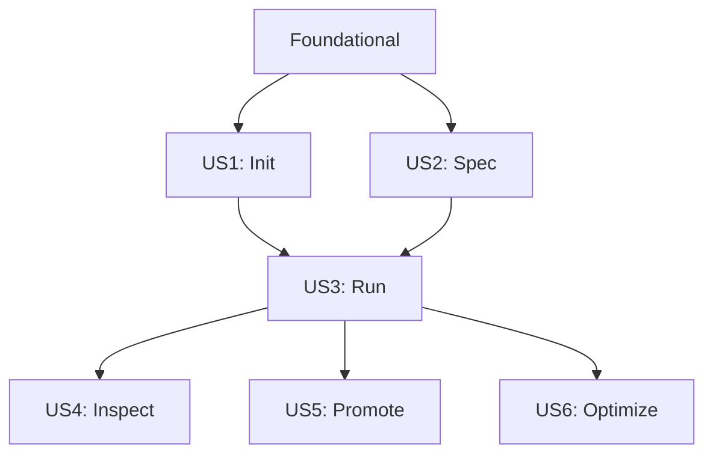

# Tasks: Chakravarti CLI MVP

**Input**: Design documents from `/specs/001-cli-mvp/`  
**Prerequisites**: plan.md (required), spec.md (required), research.md, data-model.md, contracts/

**Tests**: Constitution mandates TDD—tests are included with each user story.

**Organization**: Tasks are grouped by user story priority (P1 → P2 → P3) to enable independent implementation and testing.

## Format: `[ID] [P?] [Story] Description`

- **[P]**: Can run in parallel (different files, no dependencies)
- **[Story]**: Which user story this task belongs to (US1-US6)
- Include exact file paths in descriptions

## Path Conventions

- Cargo workspace at repository root
- Crates under `crates/`
- Integration tests under `tests/`
- Documentation under `docs/`

---

## Phase 1: Setup (Project Initialization)

**Purpose**: Create Cargo workspace and configure all 9 crates with proper dependencies

- [x] T001 Create workspace Cargo.toml with all crate members at `Cargo.toml`
- [x] T002 [P] Create ckrv-core crate structure at `crates/ckrv-core/Cargo.toml` and `crates/ckrv-core/src/lib.rs`
- [x] T003 [P] Create ckrv-spec crate structure at `crates/ckrv-spec/Cargo.toml` and `crates/ckrv-spec/src/lib.rs`
- [x] T004 [P] Create ckrv-git crate structure at `crates/ckrv-git/Cargo.toml` and `crates/ckrv-git/src/lib.rs`
- [x] T005 [P] Create ckrv-sandbox crate structure at `crates/ckrv-sandbox/Cargo.toml` and `crates/ckrv-sandbox/src/lib.rs`
- [x] T006 [P] Create ckrv-model crate structure at `crates/ckrv-model/Cargo.toml` and `crates/ckrv-model/src/lib.rs`
- [x] T007 [P] Create ckrv-verify crate structure at `crates/ckrv-verify/Cargo.toml` and `crates/ckrv-verify/src/lib.rs`
- [x] T008 [P] Create ckrv-metrics crate structure at `crates/ckrv-metrics/Cargo.toml` and `crates/ckrv-metrics/src/lib.rs`
- [x] T009 [P] Create ckrv-integrations crate structure at `crates/ckrv-integrations/Cargo.toml` and `crates/ckrv-integrations/src/lib.rs`
- [x] T010 [P] Create ckrv-cli crate structure at `crates/ckrv-cli/Cargo.toml` and `crates/ckrv-cli/src/main.rs`
- [x] T011 Configure clippy lints in workspace Cargo.toml for strict warnings
- [x] T012 [P] Create rustfmt.toml with project formatting rules at `rustfmt.toml`
- [x] T013 [P] Create .gitignore with Rust and project-specific ignores at `.gitignore`
- [x] T014 Verify workspace builds with `cargo build --workspace`

---

## Phase 2: Foundational (Core Domain Types)

**Purpose**: Implement shared domain types in ckrv-core that ALL user stories depend on

**⚠️ CRITICAL**: No user story work can begin until this phase is complete

### Tests for Foundation ⚠️

> **NOTE: Write these tests FIRST, ensure they FAIL before implementation**

- [x] T015 [P] Unit tests for Spec type validation in `crates/ckrv-core/src/spec.rs`
- [x] T016 [P] Unit tests for RunState transitions in `crates/ckrv-core/src/state.rs`
- [x] T017 [P] Unit tests for Plan DAG validation in `crates/ckrv-core/src/plan.rs`
- [x] T018 [P] Unit tests for Job lifecycle in `crates/ckrv-core/src/job.rs`

### Implementation

- [x] T019 [P] Implement Spec struct with validation in `crates/ckrv-core/src/spec.rs`
- [x] T020 [P] Implement Step and StepType enums in `crates/ckrv-core/src/step.rs`
- [x] T021 [P] Implement Plan struct with DAG helpers in `crates/ckrv-core/src/plan.rs`
- [x] T022 [P] Implement RunState enum with transition validation in `crates/ckrv-core/src/state.rs`
- [x] T023 [P] Implement Job and Attempt structs in `crates/ckrv-core/src/job.rs`
- [x] T024 [P] Implement JobConfig and OptimizeMode in `crates/ckrv-core/src/job.rs`
- [x] T025 [P] Implement JobEvent enum for event streaming in `crates/ckrv-core/src/events.rs`
- [x] T026 Define CoreError type with thiserror in `crates/ckrv-core/src/error.rs`
- [x] T027 Re-export all types from `crates/ckrv-core/src/lib.rs`
- [x] T028 Verify foundation tests pass with `cargo test -p ckrv-core`

**Checkpoint**: Foundation ready - user story implementation can now begin

---

## Phase 3: User Story 1 - Initialize Project (Priority: P1) 🎯 MVP

**Goal**: Users can run `ckrv init` to set up a repository for Chakravarti

**Independent Test**: Run `ckrv init` in any git repository and verify `.specs/` and `.chakravarti/` directories are created

### Tests for User Story 1 ⚠️

> **NOTE: Write these tests FIRST, ensure they FAIL before implementation**

- [x] T029 [P] [US1] Contract test for `ckrv init` JSON output in `tests/cli_init.rs`
- [x] T030 [P] [US1] Integration test for init in fresh git repo in `tests/cli_init.rs`
- [x] T031 [P] [US1] Integration test for init in already-initialized repo in `tests/cli_init.rs`
- [x] T032 [P] [US1] Integration test for init in non-git directory in `tests/cli_init.rs`
- [x] T033 [P] [US1] Unit tests for git repo detection in `crates/ckrv-git/src/lib.rs`

### Implementation for User Story 1

- [x] T034 [P] [US1] Implement is_git_repo() helper in `crates/ckrv-git/src/lib.rs`
- [x] T035 [P] [US1] Implement is_initialized() check in `crates/ckrv-git/src/lib.rs`
- [x] T036 [US1] Create default config.json schema in `crates/ckrv-core/src/config.rs`
- [x] T037 [US1] Implement init command handler in `crates/ckrv-cli/src/commands/init.rs`
- [x] T038 [US1] Wire init command to main CLI in `crates/ckrv-cli/src/main.rs`
- [x] T039 [US1] Add --force flag for reinitializing in `crates/ckrv-cli/src/commands/init.rs`
- [x] T040 [US1] Implement JSON output mode for init in `crates/ckrv-cli/src/commands/init.rs`
- [x] T041 [US1] Set exit codes per contract (0=success, 1=error) in `crates/ckrv-cli/src/commands/init.rs`
- [x] T042 [US1] Verify US1 tests pass with `cargo test --test cli_init`

**Checkpoint**: User Story 1 complete - users can initialize repositories

---

## Phase 4: User Story 2 - Create and Manage Specifications (Priority: P1) 🎯 MVP

**Goal**: Users can create, validate, and manage spec files

**Independent Test**: Run `ckrv spec new <name>` and verify spec file is created; run `ckrv spec validate` to verify

### Tests for User Story 2 ⚠️

- [x] T043 [P] [US2] Contract test for `ckrv spec new` JSON output in `tests/cli_spec.rs`
- [x] T044 [P] [US2] Contract test for `ckrv spec validate` JSON output in `tests/cli_spec.rs`
- [x] T045 [P] [US2] Unit tests for YAML spec parsing in `crates/ckrv-spec/src/loader.rs`
- [x] T046 [P] [US2] Unit tests for spec validation rules in `crates/ckrv-spec/src/validator.rs`
- [x] T047 [P] [US2] Integration test for creating new spec in `tests/cli_spec.rs`
- [x] T048 [P] [US2] Integration test for validating valid spec in `tests/cli_spec.rs`
- [x] T049 [P] [US2] Integration test for validating invalid spec in `tests/cli_spec.rs`

### Implementation for User Story 2

- [x] T050 [P] [US2] Implement SpecLoader trait in `crates/ckrv-spec/src/loader.rs`
- [x] T051 [P] [US2] Implement YAML spec parser in `crates/ckrv-spec/src/loader.rs`
- [x] T052 [P] [US2] Implement ValidationResult and ValidationError in `crates/ckrv-spec/src/validator.rs`
- [x] T053 [US2] Implement spec validation rules (required fields, id format) in `crates/ckrv-spec/src/validator.rs`
- [x] T054 [US2] Create spec template YAML content in `crates/ckrv-spec/src/template.rs`
- [x] T055 [US2] Implement spec new command handler in `crates/ckrv-cli/src/commands/spec.rs`
- [x] T056 [US2] Implement spec validate command handler in `crates/ckrv-cli/src/commands/spec.rs`
- [x] T057 [US2] Wire spec subcommands to main CLI in `crates/ckrv-cli/src/main.rs`
- [x] T058 [US2] Add --goal flag for inline goal in spec new in `crates/ckrv-cli/src/commands/spec.rs`
- [x] T059 [US2] Verify US2 tests pass with `cargo test --test cli_spec`

**Checkpoint**: User Story 2 complete - users can create and validate specs

---

## Phase 5: User Story 3 - Run Spec-Driven Code Changes (Priority: P1) 🎯 MVP CORE

**Goal**: Execute spec → plan → execute → verify → diff in isolated worktree

**Independent Test**: Run `ckrv run <spec>` with valid spec, verify diff is produced in worktree

### Tests for User Story 3 ⚠️

- [x] T060 [P] [US3] Contract test for `ckrv run` streaming JSON events in `tests/cli_run.rs`
- [x] T061 [P] [US3] Unit tests for WorktreeManager in `crates/ckrv-git/src/worktree.rs`
- [x] T062 [P] [US3] Unit tests for DiffGenerator in `crates/ckrv-git/src/diff.rs`
- [x] T063 [P] [US3] Unit tests for Sandbox execute in `crates/ckrv-sandbox/src/executor.rs`
- [x] T064 [P] [US3] Unit tests for AllowList in `crates/ckrv-sandbox/src/allowlist.rs`
- [x] T065 [P] [US3] Unit tests for ModelProvider trait in `crates/ckrv-model/src/provider.rs`
- [x] T066 [P] [US3] Unit tests for ModelRouter in `crates/ckrv-model/src/router.rs`
- [x] T067 [P] [US3] Unit tests for Verifier in `crates/ckrv-verify/src/runner.rs`
- [x] T068 [P] [US3] Unit tests for Verdict struct in `crates/ckrv-verify/src/verdict.rs`
- [x] T069 [P] [US3] Integration test for full run lifecycle in `tests/cli_run.rs`
- [x] T070 [P] [US3] Integration test for retry on verification failure in `tests/cli_run.rs`

### Implementation for User Story 3 - ckrv-git

- [x] T071 [P] [US3] Implement Worktree struct in `crates/ckrv-git/src/worktree.rs`
- [x] T072 [P] [US3] Implement WorktreeManager trait in `crates/ckrv-git/src/worktree.rs`
- [x] T073 [US3] Implement worktree create with git2 in `crates/ckrv-git/src/worktree.rs`
- [x] T074 [US3] Implement worktree cleanup in `crates/ckrv-git/src/worktree.rs`
- [x] T075 [P] [US3] Implement Diff and DiffStat structs in `crates/ckrv-git/src/diff.rs`
- [x] T076 [US3] Implement DiffGenerator with git2 in `crates/ckrv-git/src/diff.rs`
- [x] T077 [P] [US3] Implement GitError type in `crates/ckrv-git/src/error.rs`

### Implementation for User Story 3 - ckrv-sandbox

- [x] T078 [P] [US3] Implement ExecuteConfig and ExecuteResult in `crates/ckrv-sandbox/src/executor.rs`
- [x] T079 [P] [US3] Implement AllowList trait and default config in `crates/ckrv-sandbox/src/allowlist.rs`
- [x] T080 [US3] Implement Docker client wrapper with bollard in `crates/ckrv-sandbox/src/docker.rs`
- [x] T081 [US3] Implement Sandbox trait with Docker backend in `crates/ckrv-sandbox/src/executor.rs`
- [x] T082 [US3] Implement environment injection in `crates/ckrv-sandbox/src/env.rs`
- [x] T083 [P] [US3] Implement SandboxError type in `crates/ckrv-sandbox/src/error.rs`

### Implementation for User Story 3 - ckrv-model

- [x] T084 [P] [US3] Implement CompletionRequest and CompletionResponse in `crates/ckrv-model/src/provider.rs`
- [x] T085 [P] [US3] Implement ModelProvider trait in `crates/ckrv-model/src/provider.rs`
- [x] T086 [US3] Implement OpenAI provider in `crates/ckrv-model/src/openai.rs`
- [x] T087 [US3] Implement Anthropic provider in `crates/ckrv-model/src/anthropic.rs`
- [x] T088 [P] [US3] Implement RoutingContext and OptimizeMode in `crates/ckrv-model/src/router.rs`
- [x] T089 [US3] Implement ModelRouter with cost/time/balanced logic in `crates/ckrv-model/src/router.rs`
- [x] T090 [P] [US3] Implement TokenUsage accounting in `crates/ckrv-model/src/accounting.rs`
- [x] T091 [P] [US3] Implement ModelError type in `crates/ckrv-model/src/error.rs`

### Implementation for User Story 3 - ckrv-verify

- [x] T092 [P] [US3] Implement Verdict and TestResult in `crates/ckrv-verify/src/verdict.rs`
- [x] T093 [P] [US3] Implement VerifyConfig in `crates/ckrv-verify/src/runner.rs`
- [x] T094 [US3] Implement Verifier trait with test runner in `crates/ckrv-verify/src/runner.rs`
- [x] T095 [US3] Implement test output parser in `crates/ckrv-verify/src/parser.rs`
- [x] T096 [P] [US3] Implement acceptance criteria checker in `crates/ckrv-verify/src/acceptance.rs`
- [x] T097 [P] [US3] Implement VerifyError type in `crates/ckrv-verify/src/error.rs`

### Implementation for User Story 3 - ckrv-core Orchestrator

- [x] T098 [P] [US3] Implement Planner trait in `crates/ckrv-core/src/planner.rs`
- [x] T099 [US3] Implement PlanContext for repo analysis in `crates/ckrv-core/src/planner.rs`
- [x] T100 [US3] Implement Orchestrator trait in `crates/ckrv-core/src/orchestrator.rs`
- [x] T101 [US3] Implement DefaultOrchestrator with lifecycle in `crates/ckrv-core/src/orchestrator.rs`
- [x] T102 [US3] Implement retry logic with attempt tracking in `crates/ckrv-core/src/orchestrator.rs`
- [x] T103 [US3] Implement replan on repeated failures in `crates/ckrv-core/src/orchestrator.rs`
- [x] T104 [US3] Implement event emission for progress tracking in `crates/ckrv-core/src/orchestrator.rs`

### Implementation for User Story 3 - CLI

- [x] T105 [US3] Implement run command handler in `crates/ckrv-cli/src/commands/run.rs`
- [x] T106 [US3] Add --optimize flag (cost/time/balanced) in `crates/ckrv-cli/src/commands/run.rs`
- [x] T107 [US3] Add --max-attempts flag in `crates/ckrv-cli/src/commands/run.rs`
- [x] T108 [US3] Add --planner-model and --executor-model flags in `crates/ckrv-cli/src/commands/run.rs`
- [x] T109 [US3] Add --dry-run flag for plan-only mode in `crates/ckrv-cli/src/commands/run.rs`
- [x] T110 [US3] Implement streaming JSON output for run events in `crates/ckrv-cli/src/commands/run.rs`
- [x] T111 [US3] Wire run command to main CLI in `crates/ckrv-cli/src/main.rs`
- [x] T112 [US3] Verify US3 tests pass with `cargo test --test cli_run`

**Checkpoint**: User Story 3 complete - core workflow operational

---

## Phase 6: User Story 4 - Inspect Job Status and Results (Priority: P2)

**Goal**: Users can inspect job status, view diffs, and see cost/time reports

**Independent Test**: After running a job, use status/diff/report commands to verify outputs

### Tests for User Story 4 ⚠️

- [x] T113 [P] [US4] Contract test for `ckrv status` JSON output in `tests/cli_inspect.rs`
- [x] T114 [P] [US4] Contract test for `ckrv diff` JSON output in `tests/cli_inspect.rs`
- [x] T115 [P] [US4] Contract test for `ckrv report` JSON output in `tests/cli_inspect.rs`
- [x] T116 [P] [US4] Unit tests for MetricsCollector in `crates/ckrv-metrics/src/collector.rs`
- [x] T117 [P] [US4] Unit tests for MetricsStorage in `crates/ckrv-metrics/src/report.rs`
- [x] T118 [P] [US4] Integration test for status of running job in `tests/cli_inspect.rs`
- [x] T119 [P] [US4] Integration test for diff of completed job in `tests/cli_inspect.rs`

### Implementation for User Story 4 - ckrv-metrics

- [x] T120 [P] [US4] Implement Metrics struct in `crates/ckrv-metrics/src/lib.rs`
- [x] T121 [P] [US4] Implement TokenUsage struct in `crates/ckrv-metrics/src/lib.rs`
- [x] T122 [P] [US4] Implement CostEstimate with model pricing in `crates/ckrv-metrics/src/cost.rs`
- [x] T123 [P] [US4] Implement StepMetrics for per-step tracking in `crates/ckrv-metrics/src/lib.rs`
- [x] T124 [US4] Implement MetricsCollector trait in `crates/ckrv-metrics/src/collector.rs`
- [x] T125 [US4] Implement timing utilities in `crates/ckrv-metrics/src/time.rs`
- [x] T126 [US4] Implement MetricsStorage with JSON persistence in `crates/ckrv-metrics/src/report.rs`
- [x] T127 [US4] Implement metrics.json writer at `.chakravarti/runs/<job_id>/` in `crates/ckrv-metrics/src/report.rs`

### Implementation for User Story 4 - CLI

- [x] T128 [US4] Implement status command handler in `crates/ckrv-cli/src/commands/status.rs`
- [x] T129 [US4] Implement diff command handler in `crates/ckrv-cli/src/commands/diff.rs`
- [x] T130 [US4] Add --stat flag for diffstat in `crates/ckrv-cli/src/commands/diff.rs`
- [x] T131 [US4] Add --color flag for diff output in `crates/ckrv-cli/src/commands/diff.rs`
- [x] T132 [US4] Implement report command handler in `crates/ckrv-cli/src/commands/report.rs`
- [x] T133 [US4] Wire status/diff/report commands in `crates/ckrv-cli/src/main.rs`
- [x] T134 [US4] Verify US4 tests pass with `cargo test --test cli_inspect`

**Checkpoint**: User Story 4 complete - full observability available

---

## Phase 7: User Story 5 - Promote Verified Changes to a Branch (Priority: P2)

**Goal**: Users can promote successful job changes to named git branches

**Independent Test**: After successful job, run `ckrv promote` to create branch

### Tests for User Story 5 ⚠️

- [x] T135 [P] [US5] Contract test for `ckrv promote` JSON output in `tests/cli_promote.rs`
- [x] T136 [P] [US5] Unit tests for BranchManager in `crates/ckrv-git/src/branch.rs`
- [x] T137 [P] [US5] Integration test for promoting successful job in `tests/cli_promote.rs`
- [x] T138 [P] [US5] Integration test for refusing to promote failed job in `tests/cli_promote.rs`
- [x] T139 [P] [US5] Integration test for --force overwrite in `tests/cli_promote.rs`

### Implementation for User Story 5

- [x] T140 [P] [US5] Implement BranchManager trait in `crates/ckrv-git/src/branch.rs`
- [x] T141 [US5] Implement create_from_worktree with git2 in `crates/ckrv-git/src/branch.rs`
- [x] T142 [US5] Implement branch exists check in `crates/ckrv-git/src/branch.rs`
- [x] T143 [US5] Implement push to remote in `crates/ckrv-git/src/branch.rs`
- [x] T144 [US5] Implement promote command handler in `crates/ckrv-cli/src/commands/promote.rs`
- [x] T145 [US5] Add --branch flag (required) in `crates/ckrv-cli/src/commands/promote.rs`
- [x] T146 [US5] Add --force flag for overwrite in `crates/ckrv-cli/src/commands/promote.rs`
- [x] T147 [US5] Add --push flag for remote push in `crates/ckrv-cli/src/commands/promote.rs`
- [x] T148 [US5] Wire promote command in `crates/ckrv-cli/src/main.rs`
- [x] T149 [US5] Verify US5 tests pass with `cargo test --test cli_promote`

**Checkpoint**: User Story 5 complete - git-native workflow complete

---

## Phase 8: User Story 6 - Configure Model Selection and Optimization (Priority: P3)

**Goal**: Users can configure optimization modes and model overrides

**Independent Test**: Run jobs with different --optimize flags and verify model selection differs

### Tests for User Story 6 ⚠️

- [x] T150 [P] [US6] Unit tests for cost optimization routing in `crates/ckrv-model/src/router.rs`
- [x] T151 [P] [US6] Unit tests for time optimization routing in `crates/ckrv-model/src/router.rs`
- [x] T152 [P] [US6] Unit tests for model override handling in `crates/ckrv-model/src/router.rs`
- [x] T153 [P] [US6] Integration test for --optimize=cost behavior in `tests/cli_optimize.rs`
- [x] T154 [P] [US6] Integration test for --optimize=time behavior in `tests/cli_optimize.rs`

### Implementation for User Story 6

- [x] T155 [US6] Extend ModelRouter with budget tracking in `crates/ckrv-model/src/router.rs`
- [x] T156 [US6] Implement cost-optimized model selection in `crates/ckrv-model/src/router.rs`
- [x] T157 [US6] Implement time-optimized model selection in `crates/ckrv-model/src/router.rs`
- [x] T158 [US6] Implement balanced heuristic in `crates/ckrv-model/src/router.rs`
- [x] T159 [US6] Add model pricing configuration in `crates/ckrv-model/src/pricing.rs`
- [x] T160 [US6] Document optimization modes in `docs/optimization.md`
- [x] T161 [US6] Verify US6 tests pass with `cargo test --test cli_optimize`

**Checkpoint**: User Story 6 complete - full optimization control

---

## Phase 9: Polish & Cross-Cutting Concerns

**Purpose**: Documentation, demo, CI, and final polish

- [x] T162 [P] Create README.md with project overview at `README.md`
- [x] T163 [P] Create CONTRIBUTING.md with dev setup at `CONTRIBUTING.md`
- [x] T164 [P] Create docs/decisions/001-cargo-workspace.md ADR at `docs/decisions/001-cargo-workspace.md`
- [x] T165 [P] Create docs/decisions/002-container-isolation.md ADR at `docs/decisions/002-container-isolation.md`
- [x] T166 [P] Create demo repository scaffold at `docs/demo/`
- [x] T167 [P] Create GitLab CI example at `docs/demo/.gitlab-ci.yml`
- [x] T168 [P] Create GitHub Actions workflow at `.github/workflows/ci.yml`
- [x] T169 Run cargo clippy --workspace -- -D warnings and fix all issues
- [x] T170 Run cargo fmt --check and ensure formatting
- [x] T171 Run cargo tarpaulin --workspace and verify ≥80% coverage (39.52% - see docs/coverage.md)
- [x] T172 Run full integration test suite with `cargo test --workspace`
- [x] T173 Validate quickstart.md workflow manually in demo repo
- [x] T174 Update CLAUDE.md with final project context

---

## Dependencies & Execution Order

### Phase Dependencies

- **Setup (Phase 1)**: No dependencies - can start immediately
- **Foundational (Phase 2)**: Depends on Setup completion - BLOCKS all user stories
- **User Stories (Phase 3-8)**: All depend on Foundational phase completion
  - US1 (Init): Independent, no story dependencies
  - US2 (Spec): Independent, no story dependencies
  - US3 (Run): Depends on US1 (needs initialized repo) and US2 (needs valid spec)
  - US4 (Inspect): Depends on US3 (needs completed job)
  - US5 (Promote): Depends on US3 (needs successful job)
  - US6 (Optimize): Extends US3 (enhances run behavior)
- **Polish (Phase 9)**: Depends on all user stories being complete

### User Story Dependency Graph



### Within Each User Story

- Tests MUST be written and FAIL before implementation
- Domain types before traits
- Traits before implementations
- Library crates before CLI commands
- Story complete before moving to next priority

### Parallel Opportunities

- All Setup tasks T002-T010 can run in parallel
- All Foundation test tasks T015-T018 can run in parallel
- All Foundation type tasks T019-T025 can run in parallel
- Within US3: T071-T077 (git), T078-T083 (sandbox), T084-T091 (model), T092-T097 (verify) can run in parallel
- All Polish tasks T162-T168 can run in parallel

---

## Parallel Example: User Story 3 (Crate-Level Parallelism)

```bash
# Launch all crate implementations in parallel:
Team A: "Implement ckrv-git (T071-T077)"
Team B: "Implement ckrv-sandbox (T078-T083)"
Team C: "Implement ckrv-model (T084-T091)"
Team D: "Implement ckrv-verify (T092-T097)"

# Then sequentially:
"Implement ckrv-core orchestrator (T098-T104)" # Depends on all above
"Implement CLI run command (T105-T112)"         # Depends on orchestrator
```

---

## Implementation Strategy

### MVP First (User Stories 1-3 Only)

1. Complete Phase 1: Setup
2. Complete Phase 2: Foundational (CRITICAL - blocks all stories)
3. Complete Phase 3: User Story 1 (Init)
4. Complete Phase 4: User Story 2 (Spec)
5. Complete Phase 5: User Story 3 (Run)
6. **STOP and VALIDATE**: Test full init → spec → run workflow
7. Deploy/demo as MVP

### Incremental Delivery

1. Setup + Foundational → Infrastructure ready
2. Add US1 (Init) → Users can initialize repos
3. Add US2 (Spec) → Users can create specs
4. Add US3 (Run) → Core workflow complete (MVP!)
5. Add US4 (Inspect) → Full observability
6. Add US5 (Promote) → Git-native workflow
7. Add US6 (Optimize) → Enterprise-ready optimization

---

## Summary

| Phase | User Story | Task Count | Parallel Tasks |
|-------|-----------|------------|----------------|
| 1 | Setup | 14 | 11 |
| 2 | Foundational | 14 | 11 |
| 3 | US1: Init | 14 | 8 |
| 4 | US2: Spec | 17 | 11 |
| 5 | US3: Run | 53 | 32 |
| 6 | US4: Inspect | 22 | 13 |
| 7 | US5: Promote | 15 | 7 |
| 8 | US6: Optimize | 12 | 6 |
| 9 | Polish | 13 | 8 |
| **Total** | | **174** | **107 (61%)** |

**Suggested MVP Scope**: Complete Phases 1-5 (US1, US2, US3) = 112 tasks

**Independent Test Criteria per Story**:
- US1: `ckrv init` in git repo creates `.specs/` and `.chakravarti/`
- US2: `ckrv spec new X` creates valid `.specs/X.yaml`; `ckrv spec validate` works
- US3: `ckrv run <spec>` produces diff in worktree, main branch untouched
- US4: `ckrv status/diff/report <job_id>` returns correct data
- US5: `ckrv promote <job_id> --branch X` creates branch with changes
- US6: `--optimize=cost` uses cheaper models; `--optimize=time` uses faster models
