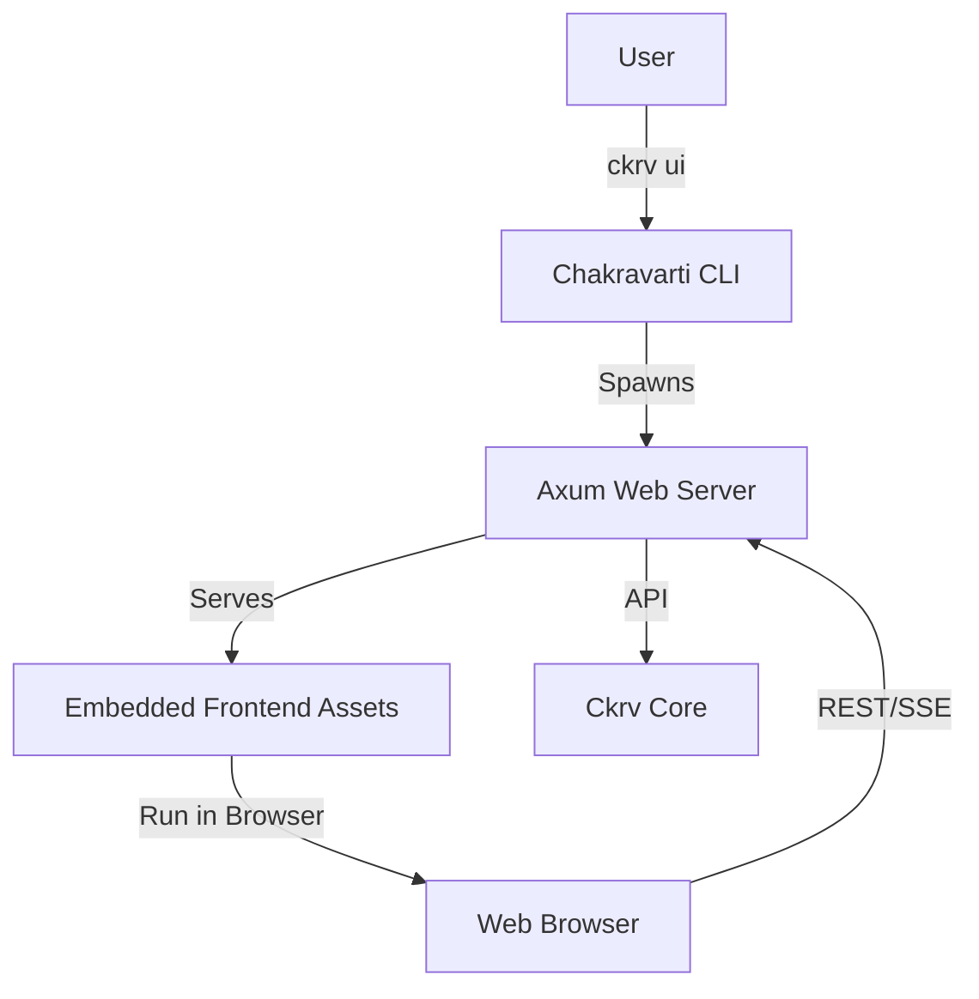

# Phase 0: Research & Architecture Decisions

## Architecture Overview

The solution adopts a "Hybrid CLI" architecture where the Rust binary acts as both the command-line tool and a local web server.

## Review Technical Context

### 1. Web Server Framework (Rust)
- **Choice**: `axum`
- **Rationale**: 
  - Part of the Tokio ecosystem (robust async).
  - Ergonomic API (macro-free routing).
  - built-in support for SSE (Server-Sent Events) and WebSockets.
  - High performance and low overhead.
- **Alternatives**:
  - `actix-web`: Good, but `axum` has better synergy with `tokio` which we likely use for agents.
  - `warp`: Filter system can be complex.

### 2. Frontend Framework
- **Choice**: React + Vite + TypeScript + TailwindCSS
- **Rationale**:
  - Industry standard, huge ecosystem.
  - Vite provides fast builds.
  - Tailwind (requested indirectly via "look good") ensures premium UI design capability.
- **State Management**: `TanStack Query` (React Query) for API state, `Zustand` for local app state.

### 3. Asset Embedding
- **Choice**: `rust-embed`
- **Rationale**:
  - Compiles definitions into the binary.
  - Zero run-time file system dependencies for the UI.
  - Supports compression (gzip) for smaller binary size.

### 4. Real-time Communication
- **Choice**: Server-Sent Events (SSE)
- **Rationale**:
  - We primarily need "Server -> Client" updates for logs and progress.
  - Simpler protocol than WebSockets (uses standard HTTP).
  - Auto-reconnection is easier to handle.
  - Sufficient for "dashboard" style monitoring.

### 5. CLI Integration
- **Command**: `ckrv ui` (alias `ckrv serve`)
- **Behavior**:
  - Starts server on localhost (default port 3000).
  - Auto-opens default browser.
  - Captures Ctrl+C to shutdown gracefully.

### 6. Data Persistence & Performance
- **Concern**: Can the file system handle orchestration state and UI reads without bottlenecks?
- **Decision**: **File System as Source of Truth (GitOps)**.
- **Rationale**:
  - **Philosophy**: Chakravarti is designed to be stateless and portable. Storing state in a hidden DB (sqlite/postgres) breaks the "everything is text/git" model.
  - **Performance**:
    - **Scale**: A typical feature has < 100 tasks and < 10 batches. Parsing `tasks.md` (text) into memory takes microseconds.
    - **Caching**: The Rust `axum` server will hold an ephemeral **In-Memory State** of the active spec/plan. It explicitly watches files for changes to invalidate this cache.
    - **Bottleneck**: The bottleneck is usually the LLM API or Docker startup, not reading text files.
  - **Concurrency**: `fslock` or similar file locking will be used if multiple processes try to write, but typically `ckrv ui` will be the primary orchestrator.
- **Future Proofing**: If parsing becomes slow (e.g. thousands of tasks), we can introduce an SQLite cache later, but for the MVP, direct file parsing is optimal for simplicity and reliability.

## Project Structure Changes

New crate `crates/ckrv-ui` will be created with:
- `frontend/`: Node.js project root.
- `src/`: Rust source for Axum server.
- `build.rs`: Custom build script to build frontend before compiling Rust (optional, or makefile driven).
