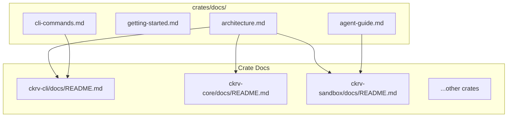

# Data Model: Documentation Artifacts

## Overview

This document defines the structure and relationships of documentation entities in the Chakravarti CLI codebase.

## Entities

### DocFile

A documentation file with frontmatter tracking.

| Field | Type | Required | Description |
|-------|------|----------|-------------|
| `last_commit` | `string` | Yes | 7-char git commit hash when last updated |
| `last_updated` | `date` | Yes | ISO date string (YYYY-MM-DD) |
| `related_files` | `string[]` | No | Relative paths to source files this doc covers |

**Example**:
```yaml
---
last_commit: c1bb442
last_updated: 2026-01-21
related_files:
  - src/lib.rs
  - src/agent/mod.rs
---
```

### CrateDoc

Documentation for a single crate, located at `crates/<crate>/docs/`.

| Component | File | Required | Description |
|-----------|------|----------|-------------|
| Overview | `README.md` | Yes | Crate purpose, key types, usage examples |
| Concepts | `concepts.md` | No | Domain concepts and patterns |
| API Guide | `api.md` | No | How to use the public API |
| Internals | `internals.md` | No | Architecture for contributors |

### TopLevelDoc

Cross-crate documentation at `crates/docs/`.

| File | Purpose |
|------|---------|
| `architecture.md` | System architecture, crate dependencies, data flow |
| `getting-started.md` | New contributor onboarding guide |
| `cli-commands.md` | Complete CLI command reference |
| `agent-guide.md` | How to add new agent integrations |

## Relationships



## Validation Rules

1. **Frontmatter Required**: Every `.md` file in docs folders MUST have valid YAML frontmatter
2. **Hash Format**: `last_commit` MUST be exactly 7 lowercase hex characters
3. **Date Format**: `last_updated` MUST be YYYY-MM-DD format
4. **Related Files**: Paths MUST be relative to crate root

## State Transitions

Documentation files have two states:

| State | Condition |
|-------|-----------|
| **Fresh** | `last_commit` matches or is ancestor of current HEAD |
| **Stale** | Files in `related_files` have been modified since `last_commit` |

Detection script logic:
```bash
# Check if doc is stale
git log --oneline $last_commit..HEAD -- $related_files | wc -l
# If > 0, doc is stale
```
