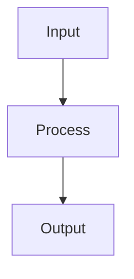

# Quickstart: Documentation Development

## Prerequisites

- Rust 1.75+ installed
- Git repository cloned
- Basic familiarity with Markdown and rustdoc

## Quick Commands

```bash
# Generate and view rustdoc
cargo doc --open --no-deps

# Check for doc warnings
cargo doc --deny warnings

# Run doc tests
cargo test --doc

# Get current commit hash for frontmatter
git rev-parse --short HEAD
```

## Creating New Documentation

### 1. Crate-Level Doc (`docs/README.md`)

```bash
# Create docs folder for a crate
mkdir -p crates/<crate-name>/docs

# Get current commit
COMMIT=$(git rev-parse --short HEAD)

# Create README with frontmatter
cat > crates/<crate-name>/docs/README.md << EOF
---
last_commit: $COMMIT
last_updated: $(date +%Y-%m-%d)
related_files:
  - src/lib.rs
---

# <crate-name>

## Overview

[One paragraph describing what this crate does]

## Key Types

- \`TypeName\`: [Description]
- \`TraitName\`: [Description]

## Usage

\`\`\`rust
use <crate_name>::KeyType;

// Example usage
\`\`\`

## Dependencies

This crate depends on:
- \`crate-a\`: For X functionality
- \`crate-b\`: For Y functionality
EOF
```

### 2. Top-Level Doc (`crates/docs/`)

```bash
mkdir -p crates/docs

# Create architecture doc
touch crates/docs/architecture.md
touch crates/docs/getting-started.md
touch crates/docs/cli-commands.md
touch crates/docs/agent-guide.md
```

### 3. Rustdoc Comments

```rust
//! Crate-level documentation goes here.
//!
//! # Overview
//!
//! Describe what this crate provides.
//!
//! # Examples
//!
//! ```rust
//! use my_crate::Thing;
//! let t = Thing::new();
//! ```

/// Function documentation.
///
/// # Arguments
///
/// * `param` - Description of parameter
///
/// # Returns
///
/// Description of return value
///
/// # Examples
///
/// ```rust
/// let result = my_function(42);
/// assert_eq!(result, 84);
/// ```
pub fn my_function(param: i32) -> i32 {
    param * 2
}
```

## Frontmatter Template

Every documentation file must start with:

```yaml
---
last_commit: <7-char-hash>
last_updated: YYYY-MM-DD
related_files:  # optional
  - path/to/source.rs
---
```

## Checking for Stale Docs

```bash
# Check if any related files changed since doc was updated
DOC_COMMIT=$(grep 'last_commit:' docs/README.md | cut -d' ' -f2)
git log --oneline $DOC_COMMIT..HEAD -- src/lib.rs
# If output is non-empty, doc may be stale
```

## Mermaid Diagrams

Use in markdown files:

````markdown

````
