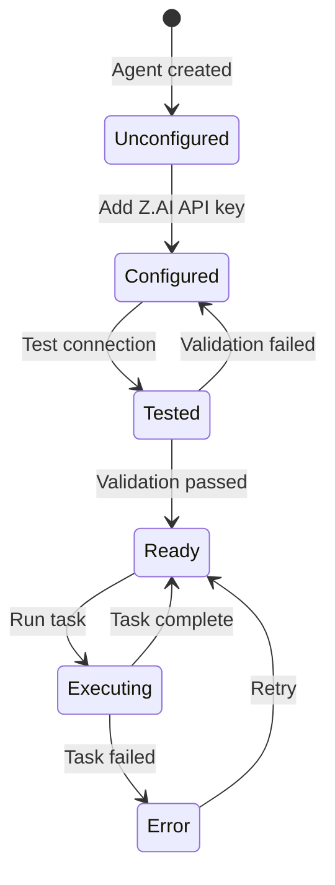
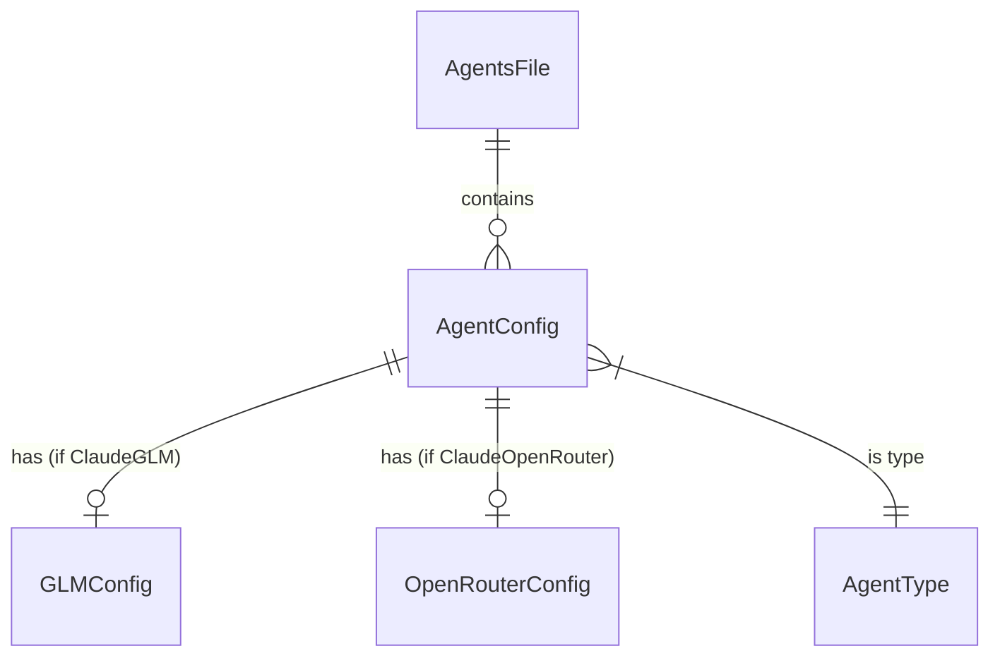

# Data Model: GLM Coding Plan Agent

**Feature**: 013-glm-coding-plan  
**Date**: 2026-01-21

## Entities

### GLMConfig (New)

Configuration for GLM Coding Plan integration. Stored in agent configuration.

| Field | Type | Required | Description |
|-------|------|----------|-------------|
| `api_key` | `Option<String>` | Yes | Z.AI API key for authentication |
| `model` | `String` | Yes | Model identifier (e.g., `glm-4.7`, `glm-4.5-air`) |
| `timeout_ms` | `Option<u32>` | No | API timeout in milliseconds (default: 3000000) |

**Validation Rules**:
- `api_key` must be non-empty when present
- `model` must be a valid GLM model name or custom model ID
- `timeout_ms` must be positive if specified

### AgentType (Extended)

Existing enum in `crates/ckrv-ui/src/api/agents.rs` - add new variant.

| Variant | Description |
|---------|-------------|
| `ClaudeGLM` | Claude Code CLI with Z.AI GLM Coding Plan API |

### AgentConfig (Extended)

Existing struct in `crates/ckrv-ui/src/api/agents.rs` - add new field.

| Field | Type | Required | Description |
|-------|------|----------|-------------|
| `glm` | `Option<GLMConfig>` | No | GLM Coding Plan config (for ClaudeGLM type) |

## Environment Variable Mapping

When executing a GLM agent, these environment variables are set:

| Variable | Value | Purpose |
|----------|-------|---------|
| `ANTHROPIC_BASE_URL` | `https://api.z.ai/api/anthropic` | Redirect API calls to Z.AI |
| `ANTHROPIC_AUTH_TOKEN` | `{glm.api_key}` | Z.AI API authentication |
| `ANTHROPIC_API_KEY` | `""` (empty) | Prevent native Claude auth |
| `API_TIMEOUT_MS` | `{glm.timeout_ms}` or `3000000` | Extended timeout for GLM |
| `ANTHROPIC_DEFAULT_SONNET_MODEL` | `{glm.model}` | Model override |
| `ANTHROPIC_DEFAULT_OPUS_MODEL` | `{glm.model}` | Model override |
| `ANTHROPIC_DEFAULT_HAIKU_MODEL` | `{glm.model}` or `glm-4.5-air` | Model override |

## State Transitions

## Relationships

