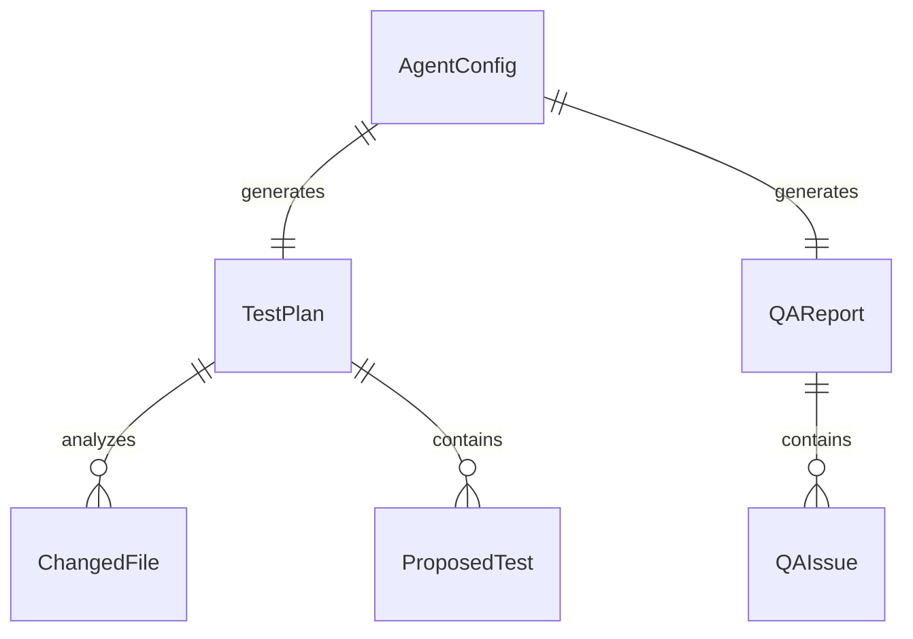
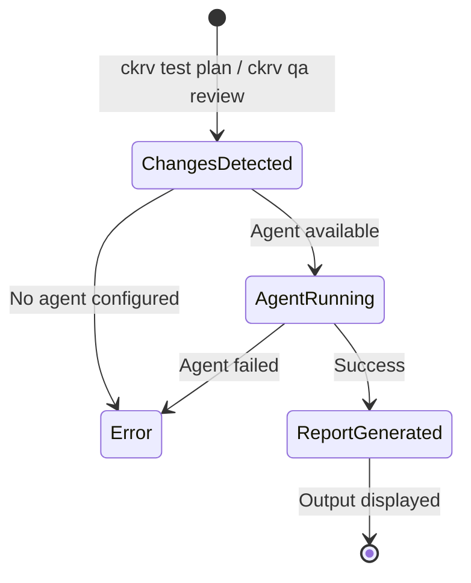

# Data Model: Test and QA Commands

**Feature**: 014-test-qa-commands  
**Date**: 2026-01-21

## Entities

### TestPlan

Generated test plan for new changes. Stored in `.chakravarti/<branch>/test-plan.md`.

| Field | Type | Required | Description |
|-------|------|----------|-------------|
| `id` | `String` | Yes | Unique plan identifier |
| `created_at` | `DateTime` | Yes | When plan was generated |
| `base_branch` | `String` | Yes | Branch compared against (default: main) |
| `changed_files` | `Vec<ChangedFile>` | Yes | Files with changes |
| `proposed_tests` | `Vec<ProposedTest>` | Yes | Tests to be written |
| `coverage_gaps` | `Vec<String>` | No | Uncovered areas identified |

### ChangedFile

Individual file that changed.

| Field | Type | Required | Description |
|-------|------|----------|-------------|
| `path` | `PathBuf` | Yes | Relative file path |
| `change_type` | `ChangeType` | Yes | Added, Modified, Deleted |
| `lines_added` | `u32` | Yes | Number of lines added |
| `lines_removed` | `u32` | Yes | Number of lines removed |
| `has_tests` | `bool` | Yes | Whether tests exist for this file |

### ChangeType (Enum)

```rust
pub enum ChangeType {
    Added,
    Modified,
    Deleted,
    Renamed,
}
```

### ProposedTest

Test suggested by the test writer agent.

| Field | Type | Required | Description |
|-------|------|----------|-------------|
| `target_file` | `PathBuf` | Yes | File being tested |
| `test_file` | `PathBuf` | Yes | Where test will be created |
| `test_type` | `TestType` | Yes | Unit, Integration, E2E |
| `description` | `String` | Yes | What the test verifies |
| `priority` | `Priority` | Yes | High, Medium, Low |

### TestType (Enum)

```rust
pub enum TestType {
    Unit,
    Integration,
    EndToEnd,
    Contract,
}
```

### QAReport

Quality analysis report from QA agent.

| Field | Type | Required | Description |
|-------|------|----------|-------------|
| `id` | `String` | Yes | Unique report identifier |
| `created_at` | `DateTime` | Yes | When report was generated |
| `base_branch` | `String` | Yes | Branch compared against |
| `issues` | `Vec<QAIssue>` | Yes | Issues found |
| `summary` | `QASummary` | Yes | Overall assessment |

### QAIssue

Individual issue found by QA agent.

| Field | Type | Required | Description |
|-------|------|----------|-------------|
| `id` | `String` | Yes | Issue identifier |
| `file` | `PathBuf` | Yes | File with issue |
| `line` | `Option<u32>` | No | Line number if applicable |
| `severity` | `Severity` | Yes | Critical, Major, Minor, Info |
| `category` | `IssueCategory` | Yes | Type of issue |
| `message` | `String` | Yes | Human-readable description |
| `suggestion` | `Option<String>` | No | How to fix |

### Severity (Enum)

```rust
pub enum Severity {
    Critical,  // Must fix before merge
    Major,     // Should fix, may block
    Minor,     // Should fix, won't block
    Info,      // Informational only
}
```

### IssueCategory (Enum)

```rust
pub enum IssueCategory {
    CodeQuality,      // Complexity, duplication, naming
    PotentialBug,     // Logic errors, edge cases
    ErrorHandling,    // Missing error handling
    Security,         // Security vulnerabilities
    Performance,      // Performance concerns
    Documentation,    // Missing/incorrect docs
    BestPractice,     // Deviation from best practices
}
```

### TestResult

Result of running tests.

| Field | Type | Required | Description |
|-------|------|----------|-------------|
| `success` | `bool` | Yes | Overall pass/fail |
| `total` | `u32` | Yes | Total tests run |
| `passed` | `u32` | Yes | Tests passed |
| `failed` | `u32` | Yes | Tests failed |
| `skipped` | `u32` | Yes | Tests skipped |
| `duration_ms` | `u64` | Yes | Total execution time |
| `failures` | `Vec<TestFailure>` | Yes | Details of failures |

## Relationships



## State Transitions


