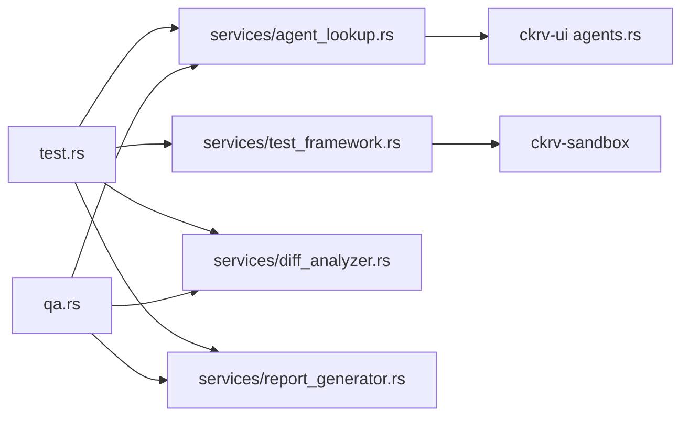

# Implementation Plan: Test and QA Commands

**Feature Branch**: `014-test-qa-commands`  
**Created**: 2026-01-21  
**Status**: Ready for Review

## Overview

Add `ckrv test` and `ckrv qa` commands for automated verification using role-based agents (test writer and QA reviewer).

## Technical Context

| Item | Value |
|------|-------|
| Language | Rust |
| Framework | clap (CLI), tokio (async) |
| Dependencies | ckrv-cli, ckrv-sandbox, ckrv-ui (agent config) |
| Test Framework | cargo test |
| Docker Required | Yes (sandbox execution) |

## Constitution Check

| Principle | Compliance | Notes |
|-----------|------------|-------|
| I. Code Quality Excellence | ✅ | Follow existing patterns from verify.rs |
| II. Testing Standards | ✅ | Add unit tests for new commands |
| III. Reliability First | ✅ | Graceful fallback when no agent configured |
| IV. Security by Default | ✅ | All execution in Docker sandbox |
| V. Deterministic CLI Behavior | ✅ | Support --json, meaningful exit codes |

## Proposed Changes

### Component 1: CLI Commands

---

#### [NEW] [test.rs](file:///apps/chakravarti-cli/crates/ckrv-cli/src/commands/test.rs)

New command module for `ckrv test` with subcommands:
- `run`: Execute tests in sandbox
- `plan`: Analyze changes and generate test plan
- `write`: Invoke test writer agent to create tests
- `coverage`: (stretch) Report coverage of changes

Key functions:
- `TestArgs`: clap Args struct with `--base`, `--json` flags
- `execute_run()`: Detect framework, run in sandbox
- `execute_plan()`: Get diff, analyze coverage gaps
- `execute_write()`: Find test writer agent, invoke via sandbox

---

#### [NEW] [qa.rs](file:///apps/chakravarti-cli/crates/ckrv-cli/src/commands/qa.rs)

New command module for `ckrv qa` with subcommands:
- `review`: Code quality analysis
- `bugs`: Bug/edge case detection
- `report`: Full QA report

Key functions:
- `QAArgs`: clap Args struct with `--base`, `--output`, `--json` flags
- `execute_review()`: Get diff, invoke QA agent
- `execute_report()`: Generate comprehensive Markdown report

---

#### [MODIFY] [mod.rs](file:///apps/chakravarti-cli/crates/ckrv-cli/src/commands/mod.rs)

Add exports for new command modules:
```rust
pub mod test;
pub mod qa;
```

---

#### [MODIFY] [main.rs](file:///apps/chakravarti-cli/crates/ckrv-cli/src/main.rs)

Register new commands in CLI:
```rust
#[derive(Subcommand)]
enum Commands {
    // ... existing
    Test(test::TestArgs),
    Qa(qa::QAArgs),
}
```

---

### Component 2: Shared Services

---

#### [NEW] [services/mod.rs](file:///apps/chakravarti-cli/crates/ckrv-cli/src/services/mod.rs)

New services module with:
- `agent_lookup`: Find agents by role
- `test_framework`: Detect and run tests
- `diff_analyzer`: Get changes vs base branch
- `report_generator`: Generate Markdown reports

---

#### [NEW] [services/agent_lookup.rs](file:///apps/chakravarti-cli/crates/ckrv-cli/src/services/agent_lookup.rs)

Agent lookup by role:
```rust
pub fn find_test_writer_agent() -> Option<AgentConfig>;
pub fn find_qa_agent() -> Option<AgentConfig>;
pub fn load_agents_config() -> Result<AgentsFile>;
```

---

#### [NEW] [services/test_framework.rs](file:///apps/chakravarti-cli/crates/ckrv-cli/src/services/test_framework.rs)

Test framework detection and execution:
```rust
pub enum TestFramework { Cargo, Npm, Pytest, GoTest, Make, Unknown }
pub fn detect_framework(cwd: &Path) -> TestFramework;
pub fn get_test_command(framework: &TestFramework) -> (String, Vec<String>);
pub async fn run_tests_in_sandbox(cwd: &Path) -> TestResult;
```

---

#### [NEW] [services/diff_analyzer.rs](file:///apps/chakravarti-cli/crates/ckrv-cli/src/services/diff_analyzer.rs)

Git diff analysis:
```rust
pub fn get_changed_files(base: &str) -> Result<Vec<ChangedFile>>;
pub fn get_diff_content(base: &str) -> Result<String>;
pub fn get_base_branch() -> Result<String>;
```

---

#### [NEW] [services/report_generator.rs](file:///apps/chakravarti-cli/crates/ckrv-cli/src/services/report_generator.rs)

Markdown report generation:
```rust
pub struct MarkdownReport { title: String, sections: Vec<Section> }
pub fn generate_test_report(result: &TestResult) -> String;
pub fn generate_qa_report(issues: &[QAIssue]) -> String;
```

---

### Component 3: Agent Prompts

---

#### [NEW] [prompts/test_writer.md](file:///apps/chakravarti-cli/crates/ckrv-cli/src/prompts/test_writer.md)

System prompt for test writer agent:
- Analyze changed files
- Identify untested code paths
- Write tests following project conventions
- Output to appropriate test directories

---

#### [NEW] [prompts/qa_reviewer.md](file:///apps/chakravarti-cli/crates/ckrv-cli/src/prompts/qa_reviewer.md)

System prompt for QA agent:
- Review code quality
- Identify potential bugs
- Check error handling
- Output structured issues

---

## Verification Plan

### Automated Tests

#### Unit Tests

Create test file at `crates/ckrv-cli/src/commands/test_test.rs`:

```bash
# Run all CLI tests
cd /apps/chakravarti-cli/crates/ckrv-cli
cargo test
```

Test cases:
1. `test_detect_framework_rust` - Cargo.toml → Cargo
2. `test_detect_framework_node` - package.json → Npm
3. `test_detect_framework_makefile` - Makefile → Make
4. `test_get_changed_files` - Parse git diff output
5. `test_qa_issue_parsing` - Parse agent output to QAIssue

#### Integration Tests

```bash
# Run integration test (requires Docker)
cd /apps/chakravarti-cli
cargo test --package ckrv-cli --test integration -- --ignored
```

### Manual Verification

#### Test 1: Run Tests Command

1. Navigate to any project with tests (e.g., `/apps/chakravarti-cli`)
2. Run: `ckrv test run`
3. **Expected**: Tests execute, Markdown output displayed
4. Run: `ckrv test run --json`
5. **Expected**: JSON output with success, passed, failed counts

#### Test 2: Test Plan Command

1. Create a feature branch with code changes
2. Run: `ckrv test plan`
3. **Expected**: 
   - Shows changed files
   - Identifies coverage gaps
   - Suggests tests to write

#### Test 3: QA Review Command

1. On a branch with changes vs main
2. Run: `ckrv qa review`
3. **Expected**:
   - QA agent analyzes changes
   - Markdown report with issues
   - Severity levels (critical/major/minor)

#### Test 4: No Agent Configured

1. Remove test_writer agent from config
2. Run: `ckrv test write`
3. **Expected**: 
   - Clear error: "No test writer agent configured"
   - Exit code 4

#### Test 5: Exit Codes

| Command | Condition | Expected Exit Code |
|---------|-----------|-------------------|
| `ckrv test run` | All tests pass | 0 |
| `ckrv test run` | Tests fail | 1 |
| `ckrv qa review` | Critical issues | 1 |
| `ckrv qa review` | No issues | 0 |

### Build Verification

```bash
# Full build check
cd /apps/chakravarti-cli
cargo build --release

# Verify help text
./target/release/ckrv test --help
./target/release/ckrv qa --help
```

## Complexity Tracking

| Area | Complexity | Justification |
|------|------------|---------------|
| CLI structure | Low | Follows existing verify.rs pattern |
| Agent invocation | Medium | Reuse engine.rs patterns from UI |
| Diff analysis | Low | Git subprocess calls |
| Sandbox execution | Medium | Docker coordination |
| Report generation | Low | String formatting |

## Dependencies



## Files Summary

| File | Action | Lines Est. |
|------|--------|------------|
| commands/test.rs | NEW | ~300 |
| commands/qa.rs | NEW | ~250 |
| commands/mod.rs | MODIFY | +2 |
| main.rs | MODIFY | +10 |
| services/mod.rs | NEW | ~20 |
| services/agent_lookup.rs | NEW | ~80 |
| services/test_framework.rs | NEW | ~120 |
| services/diff_analyzer.rs | NEW | ~100 |
| services/report_generator.rs | NEW | ~150 |
| prompts/test_writer.md | NEW | ~50 |
| prompts/qa_reviewer.md | NEW | ~50 |
| **Total** | | ~1130 |

## Risks and Mitigations

| Risk | Mitigation |
|------|------------|
| Agent output parsing varies | Define structured output format in prompts |
| Docker not running | Check Docker availability, clear error message |
| No main branch | Fall back to default branch detection |
| Large diffs timeout | Add --limit flag for file count |

## Next Steps

After plan approval:
1. Run `/speckit.tasks` to generate task breakdown
2. Implement services first (shared dependencies)
3. Implement test command
4. Implement qa command
5. Add unit tests
6. Manual verification
