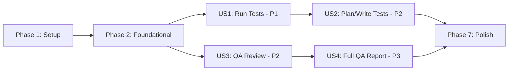

# Tasks: Test and QA Commands

**Input**: Design documents from `/specs/014-test-qa-commands/`  
**Prerequisites**: plan.md ✅, spec.md ✅, research.md ✅, data-model.md ✅, contracts/ ✅

**Tests**: Unit tests will be added as part of implementation (constitution requires testing).

**Organization**: Tasks are grouped by user story to enable independent implementation and testing.

## Format: `[ID] [P?] [Story] Description`

- **[P]**: Can run in parallel (different files, no dependencies)
- **[Story]**: Which user story this task belongs to (e.g., US1, US2, US3, US4)
- Include exact file paths in descriptions

## Path Conventions

- **CLI Crate**: `crates/ckrv-cli/src/`
- **Commands**: `crates/ckrv-cli/src/commands/`
- **Services**: `crates/ckrv-cli/src/services/`
- **Prompts**: `crates/ckrv-cli/src/prompts/`

---

## Phase 1: Setup (Shared Infrastructure)

**Purpose**: Create new modules and update CLI registration

- [x] T001 Create services module directory at `crates/ckrv-cli/src/services/mod.rs`
- [x] T002 Create prompts directory at `crates/ckrv-cli/src/prompts/`
- [x] T003 [P] Export new command modules in `crates/ckrv-cli/src/commands/mod.rs`
- [x] T004 [P] Register `test` and `qa` commands in `crates/ckrv-cli/src/main.rs`

---

## Phase 2: Foundational (Blocking Prerequisites)

**Purpose**: Shared services that ALL user stories depend on

**⚠️ CRITICAL**: No user story work can begin until this phase is complete

- [x] T005 Implement agent lookup service in `crates/ckrv-cli/src/services/agent_lookup.rs`
  - `load_agents_config()` - Load from ~/.config/chakravarti/agents.yaml
  - `find_test_writer_agent()` - Find agent with is_test_writer=true
  - `find_qa_agent()` - Find agent with is_qa_agent=true
- [x] T006 [P] Implement test framework detection in `crates/ckrv-cli/src/services/test_framework.rs`
  - `TestFramework` enum (Cargo, Npm, Pytest, GoTest, Make, Unknown)
  - `detect_framework()` - Check for Cargo.toml, package.json, etc.
  - `get_test_command()` - Return command and args for framework
- [x] T007 [P] Implement diff analyzer in `crates/ckrv-cli/src/services/diff_analyzer.rs`
  - `get_changed_files()` - Parse git diff output
  - `get_diff_content()` - Get actual diff for agent review
  - `get_base_branch()` - Detect default branch
- [x] T008 [P] Implement report generator in `crates/ckrv-cli/src/services/report_generator.rs`
  - `MarkdownReport` struct with sections
  - `generate_test_report()` - Format TestResult as Markdown
  - `generate_qa_report()` - Format QAIssues as Markdown
- [x] T009 Export all services from `crates/ckrv-cli/src/services/mod.rs`

**Checkpoint**: Foundation ready - user story implementation can now begin

---

## Phase 3: User Story 1 - Run Existing Tests (Priority: P1) 🎯 MVP

**Goal**: Developers can run project tests in an isolated Docker sandbox with a single command

**Independent Test**: Run `ckrv test run` on chakravarti-cli itself and verify Markdown output with test results

### Implementation for User Story 1

- [x] T010 [US1] Create test command skeleton in `crates/ckrv-cli/src/commands/test.rs`
  - `TestArgs` struct with subcommands enum
  - `TestSubcommand::Run` variant
  - `--base`, `--json` flags
- [x] T011 [US1] Implement `execute_run()` in `crates/ckrv-cli/src/commands/test.rs`
  - Detect test framework using test_framework service
  - Execute tests in Docker sandbox (reuse sandbox patterns from engine.rs)
  - Capture output and timing
- [x] T012 [US1] Add Markdown output formatting for test results in `crates/ckrv-cli/src/commands/test.rs`
  - Use report_generator service
  - Include summary table (total, passed, failed, duration)
  - Include failure details
- [x] T013 [US1] Add JSON output mode for CI integration in `crates/ckrv-cli/src/commands/test.rs`
  - Return TestRunOutput struct serialized as JSON
  - Set exit code 0/1 based on results
- [x] T014 [US1] Add Makefile fallback detection in `crates/ckrv-cli/src/services/test_framework.rs`
  - Check for Makefile with `test` target before Unknown
- [x] T015 [US1] Add unit tests for test framework detection in `crates/ckrv-cli/src/services/test_framework.rs`
  - test_detect_framework_rust
  - test_detect_framework_node
  - test_detect_framework_makefile

**Checkpoint**: `ckrv test run` works independently - can run tests and see Markdown results

---

## Phase 4: User Story 2 - Plan and Write New Tests (Priority: P2)

**Goal**: Test writer agent analyzes changes and creates new tests for uncovered code

**Independent Test**: Create a branch with code changes, run `ckrv test plan` to see proposed tests, then `ckrv test write` to generate them

### Implementation for User Story 2

- [x] T016 [US2] Add `TestSubcommand::Plan` variant in `crates/ckrv-cli/src/commands/test.rs`
  - Get changed files using diff_analyzer service
  - Identify files without corresponding tests
- [x] T017 [US2] Implement `execute_plan()` in `crates/ckrv-cli/src/commands/test.rs`
  - Use diff_analyzer.get_changed_files()
  - Check for existing test files
  - Generate TestPlan document
- [x] T018 [P] [US2] Create test_writer prompt in `crates/ckrv-cli/src/prompts/test_writer.md`
  - Instructions for analyzing changed files
  - Guidelines for writing tests following project conventions
  - Output format specification
- [x] T019 [US2] Add `TestSubcommand::Write` variant in `crates/ckrv-cli/src/commands/test.rs`
  - Find test writer agent using agent_lookup service
  - Return helpful error if no agent configured
- [x] T020 [US2] Implement `execute_write()` in `crates/ckrv-cli/src/commands/test.rs`
  - Load test_writer prompt
  - Include diff content and test plan in prompt
  - Invoke agent in Docker sandbox
  - Parse agent output for generated test files
- [x] T021 [US2] Add `--run` flag to `ckrv test write` in `crates/ckrv-cli/src/commands/test.rs`
  - After writing tests, optionally run them
  - Report combined results

**Checkpoint**: `ckrv test plan` and `ckrv test write` work independently

---

## Phase 5: User Story 3 - QA Code Review (Priority: P2)

**Goal**: QA agent reviews code changes for quality issues and potential bugs

**Independent Test**: Make changes and run `ckrv qa review` to receive Markdown report with issues

### Implementation for User Story 3

- [x] T022 [US3] Create qa command skeleton in `crates/ckrv-cli/src/commands/qa.rs`
  - `QAArgs` struct with subcommands enum
  - `QASubcommand::Review` variant
  - `--base`, `--output`, `--json` flags
- [x] T023 [P] [US3] Create qa_reviewer prompt in `crates/ckrv-cli/src/prompts/qa_reviewer.md`
  - Instructions for reviewing code quality
  - Categories: code_quality, potential_bug, error_handling, security
  - Output format: structured JSON for parsing
- [x] T024 [US3] Implement `execute_review()` in `crates/ckrv-cli/src/commands/qa.rs`
  - Find QA agent using agent_lookup service
  - Get diff content using diff_analyzer
  - Invoke agent with qa_reviewer prompt
- [x] T025 [US3] Parse QA agent output into QAIssues in `crates/ckrv-cli/src/commands/qa.rs`
  - Parse structured output from agent
  - Map to QAIssue structs with severity, category, message
- [x] T026 [US3] Add Markdown output for QA review in `crates/ckrv-cli/src/commands/qa.rs`
  - Use report_generator.generate_qa_report()
  - Group issues by severity (Critical → Major → Minor → Info)
  - Include file locations and suggestions
- [x] T027 [US3] Add exit code logic for QA review in `crates/ckrv-cli/src/commands/qa.rs`
  - Exit 1 if critical issues found
  - Exit 0 otherwise
- [x] T028 [US3] Add `--output` flag to save report to file in `crates/ckrv-cli/src/commands/qa.rs`

**Checkpoint**: `ckrv qa review` works independently - can analyze changes and generate report

---

## Phase 6: User Story 4 - Generate Full QA Report (Priority: P3)

**Goal**: Comprehensive QA report combining quality analysis, bug detection, and security concerns

**Independent Test**: Run `ckrv qa report` and verify output contains all analysis sections

### Implementation for User Story 4

- [x] T029 [US4] Add `QASubcommand::Report` variant in `crates/ckrv-cli/src/commands/qa.rs`
  - `--full` flag for all analysis types
- [x] T030 [US4] Implement `execute_report()` in `crates/ckrv-cli/src/commands/qa.rs`
  - Run quality review (reuse execute_review logic)
  - Run bug analysis (additional prompt section)
  - Run security scan (additional prompt section)
  - Combine into comprehensive report
- [x] T031 [US4] Enhance qa_reviewer prompt with `--full` sections in `crates/ckrv-cli/src/prompts/qa_reviewer.md`
  - Bug analysis section
  - Security scan section
  - Edge case identification
- [x] T032 [P] [US4] Add `QASubcommand::Bugs` variant in `crates/ckrv-cli/src/commands/qa.rs`
  - Focused bug/edge case analysis only

**Checkpoint**: `ckrv qa report` generates comprehensive analysis

---

## Phase 7: Polish & Cross-Cutting Concerns

**Purpose**: Improvements that affect multiple user stories

- [x] T033 [P] Add `--help` text for all commands in `crates/ckrv-cli/src/commands/test.rs` and `qa.rs`
- [x] T034 [P] Add edge case handling: no changes vs main in `crates/ckrv-cli/src/services/diff_analyzer.rs`
- [x] T035 [P] Add edge case handling: main branch doesn't exist in `crates/ckrv-cli/src/services/diff_analyzer.rs`
- [x] T036 [P] Add edge case handling: no tests in project in `crates/ckrv-cli/src/commands/test.rs`
- [x] T037 Add error messages for missing agents in `crates/ckrv-cli/src/services/agent_lookup.rs`
  - Include setup instructions
  - Exit code 4 per contracts
- [x] T038 Update CLI commands documentation in `crates/docs/cli-commands.md`
- [x] T039 Run `cargo build` and fix any compile errors
- [x] T040 Run `cargo test` and verify all new tests pass
- [x] T041 Manual verification: test `ckrv test run` on chakravarti-cli project
- [x] T042 Manual verification: test `ckrv qa review` on a branch with changes

---

## Dependencies & Execution Order

### Phase Dependencies

- **Setup (Phase 1)**: No dependencies - can start immediately
- **Foundational (Phase 2)**: Depends on Setup completion - BLOCKS all user stories
- **User Stories (Phase 3-6)**: All depend on Foundational phase completion
  - US1 (P1): Can start first - foundation for other stories
  - US2 (P2): Can start after US1 (uses test framework service)
  - US3 (P2): Can start in parallel with US2 (independent from test commands)
  - US4 (P3): Depends on US3 (extends qa review)
- **Polish (Phase 7)**: Depends on all user stories being complete

### User Story Dependencies



### Parallel Opportunities

**Phase 2 (Foundational)**:
- T006, T007, T008 can run in parallel (different services)

**Phase 3 (US1) + Phase 5 (US3)**:
- After foundational, US1 and US3 can start in parallel (independent commands)

**Phase 4 (US2)**:
- T018 (prompt) can run in parallel with T016, T017

**Phase 6 (US4)**:
- T032 can run in parallel with T029-T031

---

## Parallel Example: Foundational Phase

```bash
# Launch all foundational services together:
Task: "Implement test framework detection in crates/ckrv-cli/src/services/test_framework.rs"
Task: "Implement diff analyzer in crates/ckrv-cli/src/services/diff_analyzer.rs"
Task: "Implement report generator in crates/ckrv-cli/src/services/report_generator.rs"
```

## Parallel Example: US1 + US3

```bash
# After foundational, launch both user stories:
# Stream 1 (Test Command):
Task: "Create test command skeleton in crates/ckrv-cli/src/commands/test.rs"

# Stream 2 (QA Command):
Task: "Create qa command skeleton in crates/ckrv-cli/src/commands/qa.rs"
```

---

## Implementation Strategy

### MVP First (User Story 1 Only)

1. Complete Phase 1: Setup
2. Complete Phase 2: Foundational (CRITICAL - blocks all stories)
3. Complete Phase 3: User Story 1 (`ckrv test run`)
4. **STOP and VALIDATE**: Run `ckrv test run` on any project
5. Deploy/demo if ready

### Incremental Delivery

1. Setup + Foundational → Foundation ready
2. Add US1 (`ckrv test run`) → Test independently → **MVP!**
3. Add US3 (`ckrv qa review`) → Test independently → Deploy
4. Add US2 (`ckrv test plan/write`) → Test independently → Deploy
5. Add US4 (`ckrv qa report`) → Test independently → Deploy

---

## Summary

| Metric | Value |
|--------|-------|
| **Total Tasks** | 42 |
| **Phase 1 (Setup)** | 4 tasks |
| **Phase 2 (Foundational)** | 5 tasks |
| **Phase 3 (US1 - Run Tests)** | 6 tasks |
| **Phase 4 (US2 - Plan/Write)** | 6 tasks |
| **Phase 5 (US3 - QA Review)** | 7 tasks |
| **Phase 6 (US4 - Full Report)** | 4 tasks |
| **Phase 7 (Polish)** | 10 tasks |
| **Parallel Opportunities** | 14 tasks marked [P] |
| **MVP Scope** | Phases 1-3 (15 tasks) |

---

## Notes

- [P] tasks = different files, no dependencies
- [Story] label maps task to specific user story for traceability
- Each user story should be independently completable and testable
- Commit after each task or logical group
- Run `cargo check` frequently to catch compile errors early
- Constitution requires testing - unit tests included in each phase
