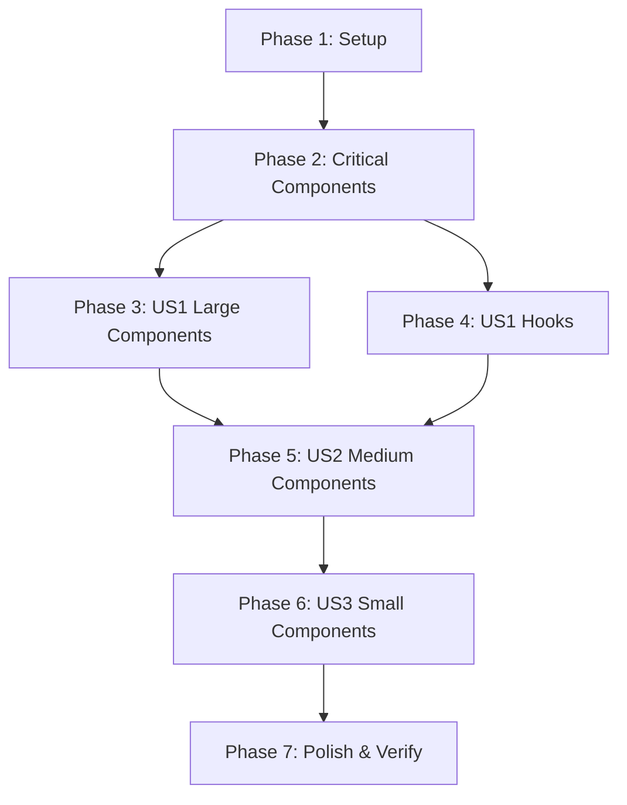

# Implementation Tasks: Frontend Code Documentation

**Branch**: `018-frontend-docs` | **Generated**: 2026-02-03  
**Spec**: [spec.md](./spec.md) | **Plan**: [plan.md](./plan.md)

## Overview

| Phase | Description | Task Count |
|-------|-------------|------------|
| Phase 1 | Setup & Preparation | 3 |
| Phase 2 | Foundational (Critical Components >800 lines) | 4 |
| Phase 3 | [US1] AI Agent Context - Large Components | 9 |
| Phase 4 | [US1] AI Agent Context - Hooks | 12 |
| Phase 5 | [US2] Developer Onboarding - Medium Components | 12 |
| Phase 6 | [US3] Consistent Style - Small Components & Layout | 7 |
| Phase 7 | Polish - README & Verification | 3 |
| **TOTAL** | | **50 tasks** |

---

## Phase 1: Setup & Preparation

**Goal**: Prepare reference materials and verification infrastructure.

- [x] T001 Review FRONTEND_CONVENTIONS.md patterns at `crates/ckrv-ui/FRONTEND_CONVENTIONS.md` ✅
- [x] T002 Review quickstart.md templates at `specs/018-frontend-docs/quickstart.md` ✅
- [x] T003 Create verification script to check @module headers at `crates/ckrv-ui/frontend/scripts/verify-docs.sh` ✅

---

## Phase 2: Foundational - Critical Components (>800 lines)

**Goal**: Document the 4 largest components that serve as templates for all others.  
**Blocking**: Must complete before other phases - these define the patterns.

### ExecutionRunner.tsx (1547 lines) - Template Component ✅ COMPLETE

- [x] T004 [P] Add @module header with @description, @context, @dependencies, @example to `ExecutionRunner.tsx` ✅
- [x] T005 [P] Add Props interface JSDoc with @example to `ExecutionRunner.tsx` ✅
- [x] T006 [P] Add section comments (STATE, EFFECTS, HANDLERS, RENDER) to `ExecutionRunner.tsx` ✅ (11 sections)
- [x] T007 Add state grouping comments for related useState calls in `ExecutionRunner.tsx` ✅ (19/19 documented)
- [ ] T008 Add inline "WHY" comments to complex logic in `ExecutionRunner.tsx` (DEFERRED)
- [x] T009 Verify handler naming follows handle* pattern in `ExecutionRunner.tsx` ✅
- [x] T010 Verify boolean props/state follow is*/has*/should*/can* pattern in `ExecutionRunner.tsx` ✅

### AgentManager.tsx (1029 lines) - @module ✅, sections ✅, Props ✅

- [x] T011a Add @module header to `AgentManager.tsx` ✅
- [x] T011b Add Props JSDoc to `AgentManager.tsx` ✅ (AgentConfig interface)
- [x] T011c Add section comments to `AgentManager.tsx` ✅ (9 sections)

### PlanEditor.tsx (923 lines) - @module ✅, sections ✅, Props ✅

- [x] T012a Add @module header to `PlanEditor.tsx` ✅
- [x] T012b Add Props JSDoc to `PlanEditor.tsx` ✅ (Batch interface)
- [x] T012c Add section comments to `PlanEditor.tsx` ✅ (8 sections)

### TestRunner.tsx (868 lines) - @module ✅, sections ✅, Props ✅

- [x] T013a Add @module header to `TestRunner.tsx` ✅
- [x] T013b Add Props JSDoc to `TestRunner.tsx` ✅ (TestResult, TestPlanOutput interfaces)
- [x] T013c Add section comments to `TestRunner.tsx` ✅ (7 sections)

---

## Phase 3: [US1] AI Agent Context - Large Components (400-800 lines)

**User Story**: AI Agent Understands Component Context (P1)  
**Goal**: Document remaining large components so AI agents can understand them in isolation.  
**Independent Test**: Open any documented component; AI can modify a prop or handler without referencing other files.

### Required Section Comments (>400 lines) ✅ COMPLETE

- [x] T014a Add @module header to `TaskEditor.tsx` (827 lines) ✅
- [x] T014b Add section comments to `TaskEditor.tsx` ✅ (9 sections)
- [x] T014c Add Props JSDoc to `TaskEditor.tsx` ✅ (Task interface)

- [x] T015a Add @module header to `SpecEditor.tsx` (708 lines) ✅
- [x] T015b Add section comments to `SpecEditor.tsx` ✅ (7 sections)
- [x] T015c Add Props JSDoc to `SpecEditor.tsx` ✅ (SpecDetail interface)

- [x] T016a Add @module header to `TaskDetailModal.tsx` (632 lines) ✅
- [x] T016b Add section comments to `TaskDetailModal.tsx` ✅ (8 sections)
- [x] T016c Add Props JSDoc to `TaskDetailModal.tsx` ✅ (TaskDetailModalProps)

- [x] T017a Add @module header to `QAReviewer.tsx` (594 lines) ✅
- [x] T017b Add section comments to `QAReviewer.tsx` ✅ (9 sections)
- [x] T017c Add Props JSDoc to `QAReviewer.tsx` ✅ (QAIssue, QAReviewOutput)

- [x] T018a Add @module header to `BarebonesExecutor.tsx` (528 lines) ✅
- [x] T018b Add section comments to `BarebonesExecutor.tsx` ✅ (10 sections)
- [x] T018c Add Props JSDoc to `BarebonesExecutor.tsx` ✅ (SimpleBatch, LogLine)

### Error Handling Documentation (FR-012)

- [x] T019 [P] [US1] Document error handling patterns in `ErrorBoundary.tsx` ✅ (@module added)
- [ ] T020 [US1] Add error handling comments to try/catch blocks in components with async operations

### State Documentation (FR-007) ✅ PARTIALLY COMPLETE

- [x] T021 [US1] Add state grouping comments to files with >5 useState calls ✅
  - TaskEditor: 10/10 documented
  - PlanEditor: 10/10 documented
  - TestRunner: 11/14 documented (+ plan/write state)
  - SpecEditor: 7/9 documented
  - AgentManager: 5/8 documented
  - QAReviewer: 5/7 documented
  - BarebonesExecutor: 5/6 documented
  - DiffViewer: 4/4 documented
  - NewSpecDialog: 4/4 documented
  - SpecWorkflow: 4/4 documented
  - TestFixModal: 4/4 documented
  - **Coverage improved from 28% → 67%**
- [ ] T022 [US1] Document complex state relationships with inline WHY comments (DEFERRED)

---

## Phase 4: [US1] AI Agent Context - Hooks ✅ COMPLETE

**User Story**: AI Agent Understands Component Context (P1)  
**Goal**: Document all hooks with @module, @param, @returns so AI understands data flow.  
**Independent Test**: AI can correctly call any hook with proper arguments.

All 12 hooks now have @module headers:

- [x] T023 [P] [US1] Add @module header to `useSpec.ts` (351 lines) ✅
- [x] T024 [P] [US1] Add @module header to `useLogStore.ts` (307 lines) ✅
- [x] T025 [P] [US1] Add @module header to `useWebSocketReconnect.ts` (235 lines) ✅
- [x] T026 [P] [US1] Add @module header to `use-toast.ts` (207 lines) ✅
- [x] T027 [P] [US1] Add @module header to `useRunHistory.ts` (202 lines) ✅
- [x] T028 [P] [US1] Add @module header to `useFocusTrap.ts` (147 lines) ✅
- [x] T029 [P] [US1] Add @module header to `useWorkflowProgress.ts` (122 lines) ✅
- [x] T030 [P] [US1] Add @module header to `useTimeout.ts` (105 lines) ✅
- [x] T031 [P] [US1] Add @module header to `useAutoSelectedSpec.ts` (114 lines) ✅
- [x] T032 [P] [US1] Add @module header to `useCommand.ts` (95 lines) ✅
- [x] T033 [P] [US1] Add @module header to `useConnection.ts` (84 lines) ✅
- [x] T034 [P] [US1] Add @module header to `useCodeTab.ts` (71 lines) ✅

---

## Phase 5: [US2] Developer Onboarding - Medium Components (200-400 lines) ✅ @module COMPLETE

**User Story**: New Developer Onboarding (P2)  
**Goal**: Document medium components so new developers understand UI structure.  
**Independent Test**: Developer unfamiliar with project understands component purpose in 5 minutes.

All @module headers complete. Section comments are RECOMMENDED (SHOULD) for 200-400 line files per FR-006a.

- [x] T035 [P] [US2] Add @module header to `WorkflowPanel.tsx` (422 lines) ✅ (sections: ✅ 5 sections)
- [x] T036 [P] [US2] Add @module header to `LogViewer.tsx` (403 lines) ✅ (sections: ✅ 4 sections)
- [x] T037 [P] [US2] Add @module header to `DiffViewer.tsx` ✅
- [x] T038 [P] [US2] Add @module header to `CompletionSummary.tsx` ✅
- [x] T039 [P] [US2] Add @module header to `TestFixModal.tsx` ✅
- [x] T040 [P] [US2] Add @module header to `CommandPalette.tsx` ✅
- [x] T041 [P] [US2] Add @module header to `AgentCliModal.tsx` ✅
- [x] T042 [P] [US2] Add @module header to `ChatDashboard.tsx` ✅
- [x] T043 [P] [US2] Add @module header to `SpecWorkflow.tsx` ✅
- [x] T044 [P] [US2] Add @module header to `RunHistoryPanel.tsx` ✅
- [x] T045 [P] [US2] Add @module header to `StatusWidget.tsx` ✅
- [x] T046 [P] [US2] Add @module header to `ClarifyModal.tsx` ✅

---

## Phase 6: [US3] Consistent Style - Small Components & Layout ✅ @module COMPLETE

**User Story**: Consistent Code Style (P3)  
**Goal**: Complete documentation coverage for all remaining files.  
**Independent Test**: Verification script passes 100% for @module headers.

### Small Components (<200 lines) ✅

- [x] T047 [P] [US3] Add @module header to `BatchLogCarousel.tsx` ✅
- [x] T048 [P] [US3] Add @module header to `BatchLogTerminal.tsx` ✅
- [x] T049 [P] [US3] Add @module header to `NewSpecDialog.tsx` ✅
- [x] T050 [P] [US3] Add @module header to `LogTerminal.tsx` ✅
- [x] T051 [P] [US3] Add @module header to `CodePage.tsx` ✅

### Layout ✅

- [x] T052 [P] [US3] Add @module header, Props JSDoc to `crates/ckrv-ui/frontend/src/layouts/Dashboard.tsx` ✅

---

## Phase 7: Polish - README & Verification ✅ COMPLETE

**Goal**: Update README and run final verification to ensure 100% compliance (SC-008).

- [x] T053 Update README.md from Vite boilerplate to project description at `crates/ckrv-ui/frontend/README.md` ✅
- [x] T054a Run /docs.frontend verification script - @module headers: 28/28 components + 12 hooks + 1 layout (100%) ✅
- [x] T054b Run remaining verification checks (section comments, state docs, Props JSDoc) ✅
- [x] T055 Create summary report documenting which files were modified and documentation coverage achieved ✅

---

## Dependencies



### Story Completion Order

| Story | Phase(s) | Dependencies | Can Start After |
|-------|----------|--------------|-----------------|
| US1 (P1) | Phase 3, 4 | Phase 2 | Phase 2 complete |
| US2 (P2) | Phase 5 | Phase 3, 4 | US1 patterns established |
| US3 (P3) | Phase 6 | Phase 5 | US2 complete |

---

## Parallel Execution

### Phase 2 Parallelism

After T004-T010 establish ExecutionRunner.tsx as template, T011-T013 can run in parallel:

```text
[T011: AgentManager] 
[T012: PlanEditor]    } All parallel after T010
[T013: TestRunner]
```

### Phase 3-4 Parallelism

All US1 tasks within each phase can run in parallel (marked [P]):

```text
Phase 3: T014, T015, T016, T017, T018, T019 - all parallel
Phase 4: T023-T034 - all 12 hooks in parallel
```

### Phase 5-6 Parallelism

All US2 and US3 tasks are independent file modifications:

```text
Phase 5: T035-T046 - all 12 medium components in parallel
Phase 6: T047-T052 - all 6 small files in parallel
```

---

## Implementation Strategy

### MVP Scope (User Story 1 only)

For fastest value delivery, complete through Phase 4:
- Phase 1: Setup (3 tasks)
- Phase 2: Critical components (10 tasks)  
- Phase 3: Large components (9 tasks)
- Phase 4: Hooks (12 tasks)

**MVP Total**: 34 tasks covering AI agent needs

### Full Scope

All 50 tasks for complete documentation coverage.

---

## Success Criteria Mapping

| Success Criteria | Tasks |
|------------------|-------|
| SC-001: 100% component @module | T004, T011-T018, T035-T051 |
| SC-002: 100% hook @module | T023-T034 |
| SC-003: 100% Props JSDoc | All component tasks |
| SC-004: Section comments >400 | T006, T011-T018 |
| SC-005: README updated | T053 |
| SC-006: Verification passes | T054 |
| SC-008: 100% compliance | T054, T055 |

---

## Task Checklist Format

Each task file modification should follow this pattern:

1. **@module header** (first content before imports):
   ```typescript
   /**
    * @module [ComponentName]
    * @description [2-4 sentences]
    * @context [Where used]
    * @dependencies [List key imports]
    * @example [Usage snippet]
    */
   ```

2. **Props JSDoc** (before interface):
   ```typescript
   /**
    * Props for [ComponentName].
    * @example { prop1: value, prop2: value }
    */
   interface [Component]Props { ... }
   ```

3. **Section comments** (for >400 line files):
   ```typescript
   // === STATE ===
   // === EFFECTS ===
   // === HANDLERS ===
   // === RENDER ===
   ```

4. **Hook docs** (for .ts hook files):
   ```typescript
   * @param paramName - Description
   * @returns Description of return value
   ```

Reference: `crates/ckrv-ui/FRONTEND_CONVENTIONS.md`
