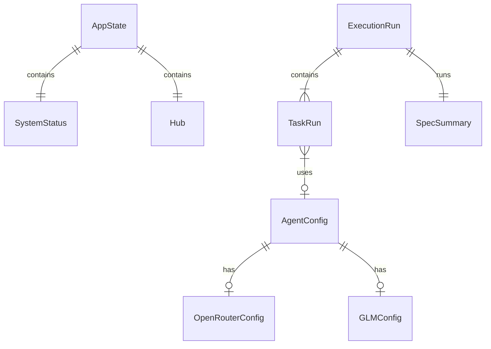

# Data Model: Transport Crate

**Feature**: 019-transport-crate
**Date**: 2026-02-04

## Overview

This document defines the core types used in the `ckrv-transport` crate. All types with `#[derive(TS)]` will generate corresponding TypeScript definitions.

---

## Core Types

### TransportError

Unified error type that converts to transport-specific responses.

```rust
use thiserror::Error;
use serde::Serialize;

/// Errors that can occur during API request handling.
///
/// Maps to HTTP status codes for Axum and error strings for Tauri.
#[derive(Debug, Error, Serialize)]
#[serde(tag = "error", content = "message")]
pub enum TransportError {
    /// Resource not found (404)
    #[error("Not found: {0}")]
    NotFound(String),
    
    /// Invalid request parameters (400)
    #[error("Bad request: {0}")]
    BadRequest(String),
    
    /// Authentication required (401)
    #[error("Unauthorized: {0}")]
    Unauthorized(String),
    
    /// Operation not permitted (403)
    #[error("Forbidden: {0}")]
    Forbidden(String),
    
    /// Conflict with current state (409)
    #[error("Conflict: {0}")]
    Conflict(String),
    
    /// Internal server error (500)
    #[error("Internal error: {0}")]
    Internal(String),
    
    /// Service unavailable (503)
    #[error("Service unavailable: {0}")]
    ServiceUnavailable(String),
}
```

### AppState

Shared application state used by all handlers.

```rust
use std::path::PathBuf;
use std::sync::Arc;
use tokio::sync::RwLock;

/// Application state shared across all handlers.
///
/// This is the single source of truth for runtime state.
/// Handlers receive a reference and should never clone the Arc.
pub struct AppState {
    /// Current system status (git branch, initialization state, etc.)
    pub status: Arc<RwLock<SystemStatus>>,
    
    /// Event hub for broadcasting real-time updates
    pub hub: Arc<Hub>,
    
    /// Root directory of the current project
    pub project_root: PathBuf,
}
```

---

## Domain Types

### System Status

```rust
use serde::{Deserialize, Serialize};
use ts_rs::TS;

/// System status information displayed in the UI header.
#[derive(Debug, Clone, Serialize, Deserialize, Default, TS)]
#[ts(export)]
pub struct SystemStatus {
    /// Name of the current project
    pub project_name: String,
    
    /// Current Git branch
    pub active_branch: String,
    
    /// Whether the project is initialized (.specs/ exists)
    pub is_ready: bool,
    
    /// Currently running spec (if any)
    pub current_spec: Option<String>,
    
    /// Current phase within the spec
    pub current_phase: Option<String>,
    
    /// Number of completed tasks
    pub completed_tasks: i32,
    
    /// Total number of tasks
    pub total_tasks: i32,
}
```

### Agent Types

```rust
/// Type of agent execution backend.
#[derive(Debug, Clone, Serialize, Deserialize, TS)]
#[ts(export)]
#[serde(rename_all = "snake_case")]
pub enum AgentType {
    /// Default Claude Code CLI
    Claude,
    /// Claude Code with custom OpenRouter API
    ClaudeOpenRouter,
    /// Claude Code with Z.AI GLM Coding Plan
    ClaudeGlm,
    /// OpenAI Codex CLI
    Codex,
}

/// Configuration for an AI agent.
#[derive(Debug, Clone, Serialize, Deserialize, TS)]
#[ts(export)]
pub struct AgentConfig {
    /// Unique identifier for this agent
    pub name: String,
    
    /// Human-readable display name
    pub display_name: String,
    
    /// Agent backend type
    pub agent_type: AgentType,
    
    /// Model identifier (e.g., "anthropic/claude-3-opus")
    pub model: Option<String>,
    
    /// Whether this is the default agent
    pub is_default: bool,
    
    /// Whether this agent is enabled
    pub enabled: bool,
    
    /// Agent-specific configuration
    #[serde(flatten)]
    pub config: AgentSpecificConfig,
}

/// Agent-specific configuration options.
#[derive(Debug, Clone, Serialize, Deserialize, TS)]
#[ts(export)]
#[serde(untagged)]
pub enum AgentSpecificConfig {
    OpenRouter(OpenRouterConfig),
    GLM(GLMConfig),
    Basic {},
}

/// OpenRouter-specific configuration.
#[derive(Debug, Clone, Serialize, Deserialize, TS)]
#[ts(export)]
pub struct OpenRouterConfig {
    pub api_key_env: String,
    pub model_id: String,
}

/// GLM-specific configuration.
#[derive(Debug, Clone, Serialize, Deserialize, TS)]
#[ts(export)]
pub struct GLMConfig {
    pub api_key_env: String,
    pub endpoint: Option<String>,
}
```

### Spec Types

```rust
/// Feature specification summary for listing.
#[derive(Debug, Clone, Serialize, Deserialize, TS)]
#[ts(export)]
pub struct SpecSummary {
    /// Spec name (directory name)
    pub name: String,
    
    /// Human-readable title
    pub title: Option<String>,
    
    /// Current status (draft, ready, running, complete)
    pub status: SpecStatus,
    
    /// Number of tasks
    pub task_count: usize,
    
    /// Last modified timestamp
    pub updated_at: String,
}

/// Spec status.
#[derive(Debug, Clone, Serialize, Deserialize, TS)]
#[ts(export)]
#[serde(rename_all = "snake_case")]
pub enum SpecStatus {
    Draft,
    Ready,
    Running,
    Complete,
    Failed,
}
```

### Execution Types

```rust
/// Execution run summary.
#[derive(Debug, Clone, Serialize, Deserialize, TS)]
#[ts(export)]
pub struct ExecutionRun {
    /// Unique run identifier
    pub id: String,
    
    /// Spec this run belongs to
    pub spec: String,
    
    /// When the run started
    pub started_at: String,
    
    /// When the run completed (if finished)
    pub completed_at: Option<String>,
    
    /// Current status
    pub status: ExecutionStatus,
    
    /// Tasks in this run
    pub tasks: Vec<TaskRun>,
}

/// Execution status.
#[derive(Debug, Clone, Serialize, Deserialize, TS)]
#[ts(export)]
#[serde(rename_all = "snake_case")]
pub enum ExecutionStatus {
    Pending,
    Running,
    Completed,
    Failed,
    Cancelled,
}

/// Individual task within an execution run.
#[derive(Debug, Clone, Serialize, Deserialize, TS)]
#[ts(export)]
pub struct TaskRun {
    /// Task identifier
    pub id: String,
    
    /// Task title
    pub title: String,
    
    /// Current status
    pub status: TaskStatus,
    
    /// Agent assigned to this task
    pub agent: Option<String>,
    
    /// Git worktree path
    pub worktree: Option<String>,
    
    /// Attempt count
    pub attempts: u32,
    
    /// Error message (if failed)
    pub error: Option<String>,
}

/// Task status.
#[derive(Debug, Clone, Serialize, Deserialize, TS)]
#[ts(export)]
#[serde(rename_all = "snake_case")]
pub enum TaskStatus {
    Pending,
    Queued,
    Running,
    Completed,
    Failed,
    Skipped,
}
```

---

## Request/Response Types

### Agent Endpoints

```rust
/// Request to create or update an agent.
#[derive(Debug, Deserialize, TS)]
#[ts(export)]
pub struct UpsertAgentRequest {
    pub agent: AgentConfig,
}

/// Request to delete an agent.
#[derive(Debug, Deserialize, TS)]
#[ts(export)]
pub struct DeleteAgentRequest {
    pub name: String,
}

/// Request to set default agent.
#[derive(Debug, Deserialize, TS)]
#[ts(export)]
pub struct SetDefaultAgentRequest {
    pub name: String,
}

/// Response from list agents.
pub type ListAgentsResponse = Vec<AgentConfig>;
```

### Execution Endpoints

```rust
/// Request to start execution.
#[derive(Debug, Deserialize, TS)]
#[ts(export)]
pub struct StartExecutionRequest {
    pub spec: String,
    pub agent: Option<String>,
    pub dry_run: Option<bool>,
}

/// Request to stop execution.
#[derive(Debug, Deserialize, TS)]
#[ts(export)]
pub struct StopExecutionRequest {
    pub spec: String,
}

/// Response from start execution.
#[derive(Debug, Serialize, TS)]
#[ts(export)]
pub struct StartExecutionResponse {
    pub run_id: String,
    pub status: ExecutionStatus,
}
```

---

## Type Generation

### ts-rs Configuration

```rust
// In lib.rs or build.rs
#[cfg(feature = "typescript")]
fn generate_typescript() {
    use ts_rs::export;
    
    // Export all types to a single file
    SystemStatus::export().unwrap();
    AgentConfig::export().unwrap();
    SpecSummary::export().unwrap();
    ExecutionRun::export().unwrap();
    // ... all other types
}
```

### Generated TypeScript (Example)

```typescript
// api.generated.ts (auto-generated, do not edit)

export interface SystemStatus {
  project_name: string;
  active_branch: string;
  is_ready: boolean;
  current_spec: string | null;
  current_phase: string | null;
  completed_tasks: number;
  total_tasks: number;
}

export type AgentType = "claude" | "claude_openrouter" | "claude_glm" | "codex";

export interface AgentConfig {
  name: string;
  display_name: string;
  agent_type: AgentType;
  model: string | null;
  is_default: boolean;
  enabled: boolean;
  // ... config fields
}

// ... more types
```

---

## Relationships


