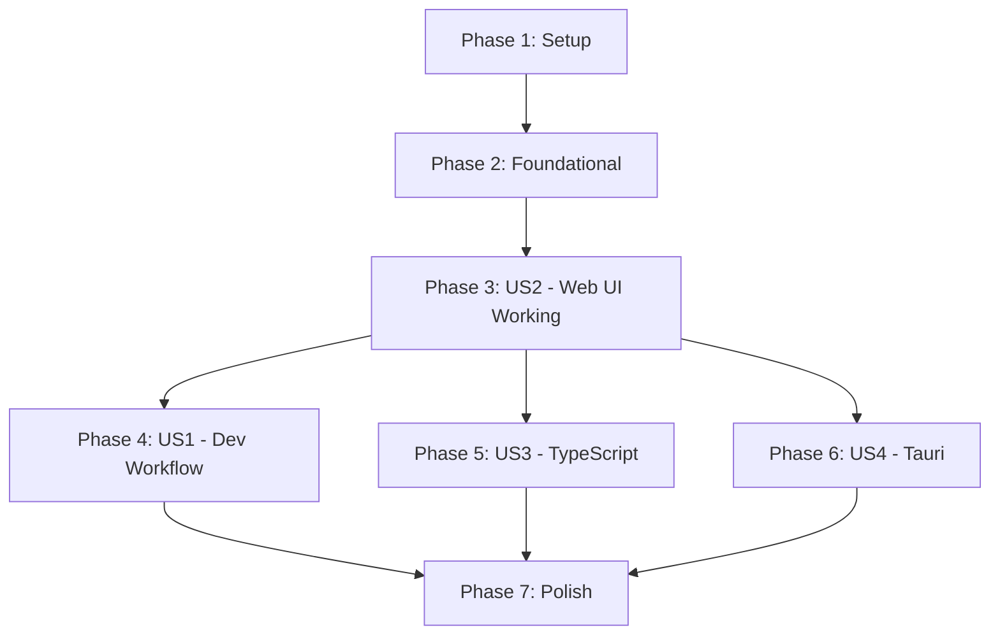

# Tasks: Transport Crate for Dual Backend Support

**Input**: Design documents from `/specs/019-transport-crate/`
**Prerequisites**: plan.md, spec.md, research.md, data-model.md, contracts/

**Tests**: Tests are included as this is a refactoring with existing functionality that must be preserved.

**Organization**: Tasks are grouped by user story to enable independent implementation and testing of each story.

## Format: `[ID] [P?] [Story] Description`

- **[P]**: Can run in parallel (different files, no dependencies)
- **[Story]**: Which user story this task belongs to (US1, US2, US3, US4)
- Include exact file paths in descriptions

## User Stories (from spec.md)

| Story | Priority | Goal |
|-------|----------|------|
| US1 | P1 | Developer can add new endpoint once, works in both backends |
| US2 | P1 | Web UI continues working unchanged after refactoring |
| US3 | P2 | TypeScript types stay in sync with Rust types |
| US4 | P3 | Future Tauri integration is enabled |

---

## Phase 1: Setup (Shared Infrastructure)

**Purpose**: Create crate structure and foundational types

- [X] T001 Add `ckrv-transport` to workspace members in `Cargo.toml` (root)
- [X] T002 Create `crates/ckrv-transport/Cargo.toml` with feature flags (axum, tauri)
- [X] T003 [P] Create `crates/ckrv-transport/src/lib.rs` with module structure and feature gates
- [X] T004 [P] Create `crates/ckrv-transport/src/error.rs` with TransportError enum
- [X] T005 [P] Create `crates/ckrv-transport/src/state.rs` with AppState struct (migrate from ckrv-ui)

**Checkpoint**: Crate compiles with `cargo build -p ckrv-transport`

---

## Phase 2: Foundational (Types & Handler Infrastructure)

**Purpose**: Core infrastructure that MUST be complete before user story implementation

**⚠️ CRITICAL**: No handler migration can begin until this phase is complete

- [X] T006 Create `crates/ckrv-transport/src/types/mod.rs` re-exporting all types
- [X] T007 [P] Create `crates/ckrv-transport/src/types/common.rs` with SystemStatus, DockerStatus
- [X] T008 [P] Create `crates/ckrv-transport/src/types/agents.rs` with AgentConfig, AgentType, etc.
- [X] T009 [P] Create `crates/ckrv-transport/src/types/specs.rs` with SpecSummary, SpecStatus, etc.
- [X] T010 [P] Create `crates/ckrv-transport/src/types/execution.rs` with ExecutionRun, TaskRun, etc.
- [X] T011 [P] Create `crates/ckrv-transport/src/types/history.rs` with RunSummary, RunDetail
- [X] T012 [P] Create `crates/ckrv-transport/src/types/test_qa.rs` with test and QA request/response types
- [X] T013 Create `crates/ckrv-transport/src/handlers/mod.rs` re-exporting all handlers
- [X] T014 Create `crates/ckrv-transport/src/axum/mod.rs` with create_router() stub and feature gate
- [X] T015 Create `crates/ckrv-transport/src/tauri/mod.rs` with get_invoke_handlers() stub and feature gate

**Checkpoint**: Foundation ready - `cargo build -p ckrv-transport --features axum` compiles

---

## Phase 3: User Story 2 - Web UI Continues Working (Priority: P1) 🎯 MVP

**Goal**: Migrate all handlers while maintaining 100% backward compatibility with existing API

**Independent Test**: Run `ckrv ui`, verify all existing features work (specs, agents, execution, history)

**IMPORTANT**: This is the MVP phase - all existing functionality must work after this phase.

### Low Complexity Handlers (Group 1)

- [X] T016 [P] [US2] Migrate status handler to `crates/ckrv-transport/src/handlers/status.rs`
- [X] T017 [P] [US2] Migrate docker handler to `crates/ckrv-transport/src/handlers/docker.rs`
- [X] T018 [P] [US2] Migrate cloud handler to `crates/ckrv-transport/src/handlers/cloud.rs`
- [X] T019 [P] [US2] Create Axum wrapper for status in `crates/ckrv-transport/src/axum/status.rs`
- [X] T020 [P] [US2] Create Axum wrapper for docker in `crates/ckrv-transport/src/axum/docker.rs`
- [X] T021 [P] [US2] Create Axum wrapper for cloud in `crates/ckrv-transport/src/axum/cloud.rs`

### Medium Complexity Handlers (Group 2)

- [X] T022 [P] [US2] Migrate agents handler to `crates/ckrv-transport/src/handlers/agents.rs`
- [X] T023 [P] [US2] Migrate specs handler to `crates/ckrv-transport/src/handlers/specs.rs`
- [X] T024 [P] [US2] Migrate plans handler to `crates/ckrv-transport/src/handlers/plans.rs`
- [X] T025 [P] [US2] Migrate tasks handler to `crates/ckrv-transport/src/handlers/tasks.rs`
- [X] T026 [P] [US2] Create Axum wrapper for agents in `crates/ckrv-transport/src/axum/agents.rs`
- [X] T027 [P] [US2] Create Axum wrapper for specs in `crates/ckrv-transport/src/axum/specs.rs`
- [X] T028 [P] [US2] Create Axum wrapper for plans in `crates/ckrv-transport/src/axum/plans.rs`
- [X] T029 [P] [US2] Create Axum wrapper for tasks in `crates/ckrv-transport/src/axum/tasks.rs`

### Medium Complexity Handlers (Group 3)

- [X] T030 [P] [US2] Migrate history handler to `crates/ckrv-transport/src/handlers/history.rs`
- [X] T031 [P] [US2] Migrate commands handler to `crates/ckrv-transport/src/handlers/commands.rs`
- [X] T032 [P] [US2] Migrate console handler to `crates/ckrv-transport/src/handlers/console.rs`
- [X] T033 [P] [US2] Migrate diff handler to `crates/ckrv-transport/src/handlers/diff.rs`
- [X] T034 [P] [US2] Create Axum wrapper for history in `crates/ckrv-transport/src/axum/history.rs`
- [X] T035 [P] [US2] Create Axum wrapper for commands in `crates/ckrv-transport/src/axum/commands.rs`
- [X] T036 [P] [US2] Create Axum wrapper for console in `crates/ckrv-transport/src/axum/console.rs`
- [X] T037 [P] [US2] Create Axum wrapper for diff in `crates/ckrv-transport/src/axum/diff.rs`

### Medium-High Complexity Handlers (Group 4)

- [X] T038 [P] [US2] Migrate qa handler to `crates/ckrv-transport/src/handlers/qa.rs`
- [X] T039 [P] [US2] Migrate session handler to `crates/ckrv-transport/src/handlers/session.rs`
- [X] T040 [P] [US2] Create Axum wrapper for qa in `crates/ckrv-transport/src/axum/qa.rs`
- [X] T041 [P] [US2] Create Axum wrapper for session in `crates/ckrv-transport/src/axum/session.rs`

### High Complexity Handlers (Group 5)

- [X] T042 [P] [US2] Migrate execution handler to `crates/ckrv-transport/src/handlers/execution.rs`
- [X] T043 [P] [US2] Migrate test handler to `crates/ckrv-transport/src/handlers/test.rs`
- [X] T044 [P] [US2] Create Axum wrapper for execution in `crates/ckrv-transport/src/axum/execution.rs`
- [X] T045 [P] [US2] Create Axum wrapper for test in `crates/ckrv-transport/src/axum/test.rs`

### Transport-Specific Handlers (Group 6)

- [X] T046 [US2] Migrate terminal WebSocket handler to `crates/ckrv-transport/src/handlers/terminal.rs`
- [X] T047 [US2] Migrate events SSE handler to `crates/ckrv-transport/src/handlers/events.rs`
- [X] T048 [US2] Create Axum wrapper for terminal in `crates/ckrv-transport/src/axum/terminal.rs`
- [X] T049 [US2] Create Axum wrapper for events in `crates/ckrv-transport/src/axum/events.rs`

### Router Integration

- [X] T050 [US2] Update `crates/ckrv-transport/src/axum/mod.rs` with complete router (all routes)
- [X] T051 [US2] Add ckrv-transport dependency to `crates/ckrv-ui/Cargo.toml` with axum feature
- [X] T052 [US2] Update `crates/ckrv-ui/src/lib.rs` to use transport's create_router()
- [X] T053 [US2] Update `crates/ckrv-ui/src/api/mod.rs` to re-export from ckrv-transport

### Verification

- [X] T054 [US2] Verify `cargo build -p ckrv-transport --features axum` succeeds
- [X] T055 [US2] Verify `cargo build -p ckrv-ui` succeeds
- [X] T056 [US2] Verify `ckrv ui` starts and all endpoints respond correctly
- [X] T057 [US2] Run existing tests with `cargo test -p ckrv-transport --features axum`

**Checkpoint**: Web UI is fully functional - US2 complete and independently testable

---

## Phase 4: User Story 1 - Developer Adds New Endpoint (Priority: P1)

**Goal**: Developers can add new endpoints by only modifying ckrv-transport

**Independent Test**: Add a placeholder endpoint in ckrv-transport, verify it works in ckrv ui

**NOTE**: This story validates the architecture created in US2

- [X] T058 [US1] Create `crates/ckrv-transport/docs/README.md` with crate documentation
- [X] T059 [US1] Document handler pattern in `crates/ckrv-transport/docs/adding-endpoints.md`
- [X] T060 [US1] Add example handler in `crates/ckrv-transport/src/handlers/example.rs` (for reference)
- [X] T061 [US1] Add example Axum wrapper in `crates/ckrv-transport/src/axum/example.rs`
- [X] T062 [US1] Verify adding endpoint only requires ckrv-transport changes

**Checkpoint**: Developer workflow validated - US1 complete

---

## Phase 5: User Story 3 - TypeScript Types Stay In Sync (Priority: P2)

**Goal**: Auto-generate TypeScript types from Rust types using ts-rs

**Independent Test**: Modify a Rust type, regenerate TypeScript, verify frontend compiles

- [X] T063 [P] [US3] Add ts-rs dependency to `crates/ckrv-transport/Cargo.toml` (optional feature)
- [X] T064 [P] [US3] Add `#[derive(TS)]` to types in `crates/ckrv-transport/src/types/common.rs`
- [X] T065 [P] [US3] Add `#[derive(TS)]` to types in `crates/ckrv-transport/src/types/agents.rs`
- [X] T066 [P] [US3] Add `#[derive(TS)]` to types in `crates/ckrv-transport/src/types/specs.rs`
- [X] T067 [P] [US3] Add `#[derive(TS)]` to types in `crates/ckrv-transport/src/types/execution.rs`
- [X] T068 [P] [US3] Add `#[derive(TS)]` to types in `crates/ckrv-transport/src/types/history.rs`
- [X] T069 [P] [US3] Add `#[derive(TS)]` to types in `crates/ckrv-transport/src/types/test_qa.rs`
- [X] T070 [US3] Create type export script in `crates/ckrv-transport/build.rs` or test
- [X] T071 [US3] Configure ts-rs output path to `crates/ckrv-ui/frontend/src/types/api.generated.ts`
- [X] T072 [US3] Generate TypeScript types and verify output
- [X] T073 [US3] Add npm script for type generation in `crates/ckrv-ui/frontend/package.json`
- [X] T074 [US3] Update frontend to import from generated types where applicable

**Checkpoint**: TypeScript types auto-generated - US3 complete

---

## Phase 6: User Story 4 - Future Tauri Integration (Priority: P3)

**Goal**: Enable future Tauri app to use ckrv-transport with tauri feature

**Independent Test**: `cargo build -p ckrv-transport --features tauri` compiles

- [X] T075 [P] [US4] Add tauri dependency to `crates/ckrv-transport/Cargo.toml` (optional)
- [X] T076 [P] [US4] Create Tauri command for status in `crates/ckrv-transport/src/tauri/status.rs`
- [X] T077 [P] [US4] Create Tauri command for agents in `crates/ckrv-transport/src/tauri/agents.rs`
- [X] T078 [P] [US4] Create Tauri command stubs for remaining handlers in `crates/ckrv-transport/src/tauri/`
- [X] T079 [US4] Update `crates/ckrv-transport/src/tauri/mod.rs` with get_invoke_handlers()
- [X] T080 [US4] Verify `cargo build -p ckrv-transport --features tauri` succeeds
- [X] T081 [US4] Document Tauri integration in `crates/ckrv-transport/docs/tauri-integration.md`

**Checkpoint**: Tauri feature compiles - US4 complete

---

## Phase 7: Polish & Cross-Cutting Concerns

**Purpose**: Cleanup, documentation, and final verification

- [X] T082 [P] Update `crates/docs/architecture.md` to include ckrv-transport crate
- [X] T083 [P] Add ckrv-transport to README.md crate listing
- [X] T084 Remove deprecated code from `crates/ckrv-ui/src/api/*.rs` (keep re-exports only)
- [X] T085 Remove deprecated `crates/ckrv-ui/src/state.rs` (now in ckrv-transport)
- [X] T086 Run `cargo clippy -p ckrv-transport --features axum` and fix warnings
- [X] T087 Run `cargo clippy -p ckrv-transport --features tauri` and fix warnings
- [X] T088 Verify all integration tests pass
- [X] T089 Validate against quickstart.md scenarios

---

## Dependencies & Execution Order

### Phase Dependencies



- **Setup (Phase 1)**: No dependencies - can start immediately
- **Foundational (Phase 2)**: Depends on Phase 1 - BLOCKS all user stories
- **US2 (Phase 3)**: Depends on Phase 2 - This is the MVP
- **US1 (Phase 4)**: Depends on Phase 3 (validates the architecture)
- **US3 (Phase 5)**: Depends on Phase 3 (types must exist)
- **US4 (Phase 6)**: Depends on Phase 3 (handlers must exist)
- **Polish (Phase 7)**: Depends on all desired user stories

### User Story Dependencies

- **User Story 2 (P1)**: Primary - Must complete first (MVP)
- **User Story 1 (P1)**: Validates US2 architecture - depends on US2
- **User Story 3 (P2)**: Can proceed after US2 - independent
- **User Story 4 (P3)**: Can proceed after US2 - independent

### Parallel Opportunities

**Phase 1** - All setup tasks:
```bash
# T003, T004, T005 can run in parallel (different files)
```

**Phase 2** - Type definitions:
```bash
# T007, T008, T009, T010, T011, T012 can run in parallel (different type files)
```

**Phase 3** - Handler migration groups:
```bash
# Group 1 (T016-T021): Low complexity handlers - all parallel
# Group 2 (T022-T029): Medium complexity handlers - all parallel
# Group 3 (T030-T037): Medium complexity handlers - all parallel
# Group 4 (T038-T041): Medium-high complexity handlers - all parallel
# Group 5 (T042-T045): High complexity handlers - all parallel
```

**Phase 5 & 6** - After US2:
```bash
# US3 (TypeScript) and US4 (Tauri) can proceed in parallel by different developers
```

---

## Parallel Example: Handler Migration (Phase 3, Group 2)

```bash
# All of these can be launched together:
Task: "Migrate agents handler to crates/ckrv-transport/src/handlers/agents.rs"
Task: "Migrate specs handler to crates/ckrv-transport/src/handlers/specs.rs"
Task: "Migrate plans handler to crates/ckrv-transport/src/handlers/plans.rs"
Task: "Migrate tasks handler to crates/ckrv-transport/src/handlers/tasks.rs"
```

---

## Implementation Strategy

### MVP First (User Story 2 Only)

1. Complete Phase 1: Setup (T001-T005)
2. Complete Phase 2: Foundational (T006-T015)
3. Complete Phase 3: User Story 2 (T016-T057)
4. **STOP and VALIDATE**: Run `ckrv ui` and verify all endpoints
5. Deploy if ready - web UI works identically

### Incremental Delivery

1. Setup + Foundational → Crate compiles
2. Add US2 (handlers) → Test with `ckrv ui` → **MVP Complete!**
3. Add US1 (docs) → Developer workflow validated
4. Add US3 (TypeScript) → Type safety added
5. Add US4 (Tauri) → Desktop app enabled
6. Each story adds value without breaking previous stories

### Parallel Team Strategy

With multiple developers:

1. Team completes Setup + Foundational together
2. Once Foundational is done:
   - All: Work on US2 handler migration (many parallel tasks)
3. After US2 complete:
   - Developer A: US1 (documentation)
   - Developer B: US3 (TypeScript)
   - Developer C: US4 (Tauri)
4. Stories complete and integrate independently

---

## Summary

| Phase | Tasks | Parallel | Story |
|-------|-------|----------|-------|
| Phase 1: Setup | 5 | 3 | - |
| Phase 2: Foundational | 10 | 7 | - |
| Phase 3: US2 - Web UI | 42 | 34 | US2 (P1) |
| Phase 4: US1 - Dev Workflow | 5 | 0 | US1 (P1) |
| Phase 5: US3 - TypeScript | 12 | 7 | US3 (P2) |
| Phase 6: US4 - Tauri | 7 | 4 | US4 (P3) |
| Phase 7: Polish | 8 | 2 | - |
| **Total** | **89** | **57** | |

**MVP Scope**: Phases 1-3 (57 tasks) → Web UI works with new architecture
**Full Scope**: All phases (89 tasks) → Complete transport abstraction with TypeScript and Tauri

---

## Notes

- [P] tasks = different files, no dependencies on incomplete tasks
- [Story] label maps task to specific user story for traceability
- Each user story is independently completable and testable
- Handler migration is highly parallelizable (34 parallel tasks in Phase 3)
- Commit after each task or logical group
- Stop at any checkpoint to validate story independently
- WebSocket/SSE handlers (terminal, events) are NOT parallel - transport-specific complexity
